# ADR 0006: Read-Only Evidence-Grounded AI Orchestration

<!-- markdownlint-disable MD013 MD036 MD060 -->

- Status: Accepted for architecture and local validation; AWS implementation is not authorized
- Date: 2026-08-30
- Decision owner: Energy Data Lakehouse repository owner
- Related tracker milestone: September AWS Startup Solutions Architect interview preparation
- Decision register: `docs/planning/ai-orchestration-architecture-decision-register-20260830.md`
- Runtime boundary: `docs/adr/0007-bedrock-runtime-and-orchestration-framework-boundary.md`
- Target diagram: `diagrams/ai-orchestration-evidence-grounded-target.svg`

## Context

The Energy Data Lakehouse already has a proven managed-AI batch workflow:

- EventBridge starts a Step Functions workflow on a schedule;
- Lambda creates versioned energy and news artifacts in private S3 paths;
- Bedrock/Mistral produces an `ai_insight_v1` candidate;
- strict schema validation, sanitisation, deterministic fallback, failed-path
  quarantine, SNS notification, and public-safe publication protect the trust
  boundary; and
- scheduled-run and budget-guardrail evidence exists through Phase 17AU.

That workflow produces a bounded dashboard insight. It does not yet answer an
analyst's question across changing structured market facts and supporting
documents, retrieve evidence on demand, or evaluate citation and grounding
quality.

The interview assignment benefits from a credible GenAI evolution, but the
repository does not need an open-ended AI platform. The next architecture must
maximize learning and interview evidence while minimizing cost, operating
surface, unsafe agency, and unsupported claims.

## Decision Drivers

1. Answers must be traceable to approved, fresh evidence.
2. Structured market facts and unstructured documents require different
   retrieval methods.
3. The first use case is decision support, not autonomous action.
4. Existing schemas, private/public boundaries, failure handling, and fallback
   must remain useful rather than being bypassed.
5. Model, embedding, vector-store, and managed-service choices must follow
   representative evaluation instead of preceding it.
6. The architecture must remain cheap and understandable for one owner and a
   portfolio-scale workload.
7. A local proof must not be misrepresented as a deployed customer capability.

## Scope And Non-Goals

### In Scope

- The architectural boundary between the proven scheduled insight workflow and
  a proposed question-answering experience.
- Structured evidence, document retrieval, routing, evidence assembly, answer
  generation, verification, abstention, and evaluation.
- Data authority, provenance, freshness, access, IAM, threat, failure,
  observability, reliability, performance, and cost decisions.
- A local, read-only validation route and the criteria for a later AWS service
  decision.
- Explicit promotion, stop, revisit, and rollback conditions.

### Non-Goals

- A general-purpose enterprise AI platform.
- A production chat product or polished user interface.
- Natural-language access to unrestricted SQL or arbitrary tools.
- Autonomous planning, write operations, publication, notification, trading,
  remediation, or infrastructure changes.
- Production multi-tenancy, custom model hosting, fine-tuning, or multi-Region
  serving.
- Selecting an AWS knowledge-base, vector, search, relational, or agent service
  before the evaluation contract exists.
- Retrospectively claiming that a design or local proof was a customer result.

## Business And Stakeholder Assumptions

The provisional user is an energy analyst, operator, founder, or product leader
who needs to move from a question to trustworthy evidence faster. The exact
stakeholder, current workflow, decision, and measured impact remain inputs to
the interview narrative and must be supplied truthfully.

The current architecture assumes:

- one repository owner and one primary workload account;
- public or portfolio-safe energy and news evidence;
- modest corpus and request volume;
- read-only decision support;
- no contractual tenant isolation or regulated personal data; and
- cost sensitivity greater than sub-second response requirements.

These are assumptions, not permanent constraints. Any customer-confidential,
regulated, multi-tenant, high-throughput, or action-taking use case requires a
new decision review.

## Requirements And Architectural Responses

| ID | Requirement | Architectural response |
|---|---|---|
| BR-01 | Help a user reach trusted evidence faster | Measure time to trusted answer against a deterministic search/query baseline. |
| BR-02 | Explain where an answer came from | Require internal provenance and public-safe citations for every `answered` outcome. |
| BR-03 | Keep operating cost proportionate to uncertain demand | Use an evaluation-first, local-first path; bound retrieval, tokens, query scan, concurrency, and storage before deployment. |
| BR-04 | Preserve the current working dashboard insight | Add a separate query path; do not replace or weaken the scheduled workflow. |
| FR-01 | Answer exact metric and date questions | Use a deterministic structured evidence adapter with allowlisted parameters or curated facts. |
| FR-02 | Answer explanatory and news questions | Use metadata-filtered document retrieval over an approved corpus. |
| FR-03 | Answer combined questions | Assemble structured and document evidence into one versioned evidence pack before generation. |
| FR-04 | Handle insufficient, stale, conflicting, unsafe, or unauthorized evidence | Return an explicit non-answer outcome rather than synthesizing unsupported certainty. |
| FR-05 | Reproduce and audit an answer | Record trace, corpus, query-template, evidence, prompt, model, policy, and contract versions without logging secrets. |
| NFR-01 | Protect private and public boundaries | Keep raw, failed, private, and unapproved content outside the retrieval corpus and public answer contract. |
| NFR-02 | Rebuild derived state | Keep curated S3 artifacts authoritative and make retrieval projections reproducible from versioned manifests. |
| NFR-03 | Degrade safely | Preserve last-known-good batch output; use deterministic fallback or abstention for query-path failures. |
| NFR-04 | Remain observable | Measure routing, retrieval, generation, verification, outcomes, latency, errors, and cost by trace ID. |
| NFR-05 | Remain changeable | Hide models, embeddings, retrieval engines, and query executors behind explicit contracts. |

Numeric objectives are deliberately not invented in this ADR. P1 must set
targets from the real user decision and non-GenAI baseline.

ADR 0007 later selects Bedrock as the default AWS inference boundary, retains
Step Functions/Lambda for the current verified workflow, rejects OpenClaw/ECS,
and defers LangGraph. The provider-neutral domain contract in this ADR remains
important: it prevents Bedrock request/response details from becoming the
evidence or answer contract and preserves evaluation and rollback options.

## Decision

Adopt a **read-only, evidence-grounded decision-support pattern** as the next AI
orchestration architecture.

The pattern combines two controlled evidence paths:

1. **Structured evidence path:** use allowlisted, parameterized queries or
   precomputed curated facts for exact energy metrics, dates, and comparisons.
2. **Document evidence path:** use metadata-filtered retrieval over approved
   curated news, explanatory documents, and repository-safe reference content.

The answer composer may use one or both paths, but it must receive evidence
references rather than unrestricted data access. Every successful answer must
carry citations or structured references. If freshness, authorization,
retrieval, validation, or grounding checks fail, the system must abstain or
return a deterministic non-GenAI result.

### Architecture Boundary

```text
validated curated S3 data and approved documents
  -> asynchronous normalize, version, enrich, and index flow
  -> rebuildable structured-fact and document-retrieval projections

read-only question
  -> input and policy checks
  -> controlled route: structured facts, document retrieval, or both
  -> evidence assembly with freshness and provenance
  -> model synthesis behind a provider-neutral adapter
  -> schema, citation, grounding, and safety checks
  -> cited answer, deterministic fallback, or abstention
```



## Logical Component Responsibilities

| Component | Responsibility | Must not do |
|---|---|---|
| Curated S3 authority | Retain versioned, validated source evidence and contracts | Behave as a public retrieval surface or expose raw/failed data by default |
| Corpus selector | Admit only approved sources, prefixes, document types, classifications, and versions | Crawl the whole bucket, repository, internet, or failed paths |
| Normalizer and metadata enricher | Produce stable text/fact units, hashes, timestamps, classification, access scope, and lineage | Rewrite source meaning or discard provenance |
| Structured evidence adapter | Resolve exact facts through allowlisted templates or curated fact projections | Execute arbitrary model-generated SQL or unbounded scans |
| Document retrieval adapter | Retrieve approved explanatory/news evidence with metadata filters | Treat similarity as authorization or freshness proof |
| Route contract | Select `structured`, `document`, `combined`, or `unsupported` through bounded output | Invent tools, plans, permissions, or external actions |
| Evidence assembler | Deduplicate, order, cap, and package evidence with provenance and freshness | Pass unrestricted source payloads or instructions from evidence into system control |
| Answer composer | Synthesize only from the supplied evidence under a provider-neutral contract | Claim facts that are not supported by the evidence pack |
| Verifier and policy gate | Validate schema, citations, grounding, safety, freshness, and authorization | Repair an unsupported answer into apparent validity without re-evaluation |
| Outcome renderer | Return a cited answer, warning, fallback, or explicit abstention | Publish private locators or hide degraded evidence state |
| Evaluation harness | Run versioned representative cases and compare baselines/candidates | Use production traffic or private data without an approved governance boundary |
| Telemetry boundary | Record traceable measurements and decision versions | Log secrets, credentials, unnecessary full prompts, or confidential evidence |

## End-To-End Sequences

### Evidence Preparation Sequence

1. A validated curated artifact or approved document version becomes eligible
   for corpus selection.
2. The selector verifies source allowlist, classification, access scope,
   content type, version, and deletion state.
3. Normalization produces structured facts or document units without changing
   the source meaning.
4. Each unit receives stable provenance, effective-time, ingestion-time,
   version/hash, and access metadata.
5. Structured facts and document units are written to separate derived
   projections.
6. Retrieval/index writes complete before a new corpus manifest becomes active.
7. Failed preparation is quarantined; the prior complete manifest remains the
   last-known-good retrieval version.
8. Deletion or revocation creates an explicit removal/tombstone operation and
   blocks the affected version from future answer packs.

The trigger, index implementation, and atomic-manifest mechanism are logical
requirements. Their AWS services are pending the later topology decision.

### Read-Only Answer Sequence

1. Validate request shape, size, supported language, caller scope, and cost
   limits; assign a trace and query ID.
2. Produce a constrained route outcome: structured, document, combined, or
   unsupported.
3. Execute only the allowlisted structured templates and metadata-filtered
   retrieval allowed for that route and caller.
4. Reject or label evidence that is stale, unauthorized, conflicting, or below
   the accepted retrieval threshold.
5. Assemble a versioned evidence pack with internal provenance and public-safe
   citation candidates.
6. Use the model only when the evidence pack and policy permit generation.
7. Validate the answer contract, citation targets, grounding, safety, and
   freshness.
8. Return a validated answer, deterministic result, partial-evidence warning,
   or explicit abstention.
9. Emit telemetry keyed by trace ID and decision versions without exposing
   private evidence in public logs or output.

## Proposed Contract Boundaries

These are logical contract shapes for P1-P4. They are not implemented schemas.

### Route Decision

```json
{
  "schema_version": "route_decision_v1",
  "query_id": "query-...",
  "route": "structured|document|combined|unsupported",
  "structured_template_ids": [],
  "document_filters": {},
  "as_of": "2026-08-30T00:00:00Z",
  "reason_code": "bounded-enum"
}
```

The route must use enumerated templates and filters. Free-form model-generated
SQL, tool names, resource identifiers, or action plans are invalid.

### Internal Evidence Reference

```json
{
  "evidence_id": "stable-id",
  "evidence_type": "structured_fact|document_chunk",
  "source_id": "source-id",
  "source_version": "version-or-hash",
  "private_locator": "internal-artifact-reference",
  "public_locator": "public-safe-reference-or-null",
  "effective_at": "2026-08-30T00:00:00Z",
  "ingested_at": "2026-08-30T00:05:00Z",
  "classification": "public|internal",
  "access_scope": "scope-id"
}
```

Internal provenance and public citation are deliberately separate. A private S3
key must not become a public citation merely because it was retrieved.

### Evidence Pack

```json
{
  "schema_version": "evidence_pack_v1",
  "query_id": "query-...",
  "route": "combined",
  "corpus_version": "manifest-version",
  "structured_evidence": [],
  "document_evidence": [],
  "freshness": {},
  "conflicts": [],
  "warnings": []
}
```

The evidence pack is the only knowledge input to the answer composer. System
instructions and policy are supplied separately.

### Answer Outcome

```json
{
  "schema_version": "grounded_answer_v1",
  "query_id": "query-...",
  "outcome": "answered|partial_evidence|insufficient_evidence|stale_evidence|conflicting_evidence|not_authorized|unsafe_request|invalid_request|rate_limited|system_error",
  "answer": "text-or-null",
  "citations": [],
  "warnings": [],
  "as_of": "2026-08-30T00:00:00Z",
  "trace_id": "trace-..."
}
```

The public contract omits private locators, raw prompts, credentials, internal
policy details, and unrestricted model reasoning.

## State, Freshness, And Consistency

- Curated evidence is authoritative; retrieval projections are disposable.
- Index/corpus versions must be immutable and addressable by manifest version.
- A manifest becomes active only after every required projection write passes
  validation.
- Query telemetry records the corpus version used, so an answer can be
  reproduced or investigated.
- Freshness is evaluated from effective/source time and ingestion/index time,
  not from object existence alone.
- Cache keys must include access scope, route, normalized question or template
  parameters, corpus version, and policy version.
- Corpus updates invalidate or naturally bypass caches through versioned keys.
- Conflicting source facts remain visible in the evidence pack; the model may
  summarize the conflict but must not silently choose a winner.
- Revoked or deleted evidence is excluded from new manifests and cache hits.

### Decision 1: Preserve The Existing Workflow

Keep the current scheduled dashboard-insight workflow as the verified baseline.
Do not replace its Step Functions, schema, fallback, quarantine, alert, or
publication path to create the interview enhancement.

The new decision-support path is additive and initially local. Existing S3
artifacts and contracts may be reused only through explicit adapters.

### Decision 2: Separate Asynchronous Preparation From Synchronous Answers

Use an asynchronous flow for corpus selection, normalization, chunking,
metadata enrichment, embedding, indexing, and offline evaluation. The existing
Step Functions pattern is a suitable orchestration model for this eventual
data-preparation plane because the work is multi-step, retryable, observable,
and not latency-sensitive.

Keep the request-time answer path logically separate. It needs a bounded
latency budget and should not inherit the entire batch-publication workflow.
The first proof will invoke the path locally; an API or production serving
topology is not selected or authorized by this ADR.

### Decision 3: Keep S3 And Curated Contracts Authoritative

S3 curated artifacts and their schemas remain the system of record. Any search
or vector index is a derived, rebuildable projection, not a new authority.

Each indexed unit must retain at least:

- stable source and document identifier;
- source version or content hash;
- source URI or artifact key;
- generated or effective timestamp;
- ingestion timestamp;
- data classification and access scope;
- schema or content type; and
- chunk position where chunking is used.

Raw lake objects, failed payloads, private identifiers, and unapproved
repository content are outside the retrieval corpus.

### Decision 4: Use Controlled Routing, Not An Autonomous Agent

Route a question to the structured path, document path, or both through
explicit rules or a constrained classifier with a fixed output contract. The
router cannot invent tools, change data, publish, deploy, send messages, or
perform external actions.

Read-only, allowlisted query execution is acceptable as a later bounded
capability. General tool selection and autonomous multi-step agency are not
required for the current business problem.

### Decision 5: Evaluate Before Selecting Technology

Do not select the final embedding model, generation model, chunking strategy,
retrieval engine, reranker, managed knowledge-base product, or AWS deployment
topology yet.

First define a representative offline evaluation contract containing:

- exact structured questions;
- document lookup questions;
- combined market-and-news questions;
- unanswerable, stale, conflicting, and unsafe questions; and
- expected evidence, answer constraints, and abstention behaviour.

Compare the AI path with a non-GenAI baseline. Select technology only when the
candidate improves task success or time to trusted evidence without violating
quality, safety, latency, and cost gates.

### Decision 6: Make Abstention A Successful Outcome

The answer contract must support at least:

- `answered` with verified evidence references;
- `partial_evidence` with an explicit warning;
- `insufficient_evidence`;
- `stale_evidence`;
- `conflicting_evidence`;
- `not_authorized`; and
- `unsafe_request`;
- `invalid_request`;
- `rate_limited`; and
- `system_error`.

A fluent unsupported answer is a failure. A clear abstention with the reason
and safe next step is a valid system outcome.

## Alternatives And Rejected Choices

The accepted architecture is meaningful only in comparison with credible
alternatives. **Rejected** means the option does not fit the current problem or
would create disproportionate risk. **Deferred** means it may become suitable
after a named evidence trigger. **Retained as a baseline** means the option is
still useful for comparison or as one component, but is insufficient as the
complete target architecture.

| Option | Decision | Why |
|---|---|---|
| Controlled read-only structured retrieval plus document retrieval | Accepted | Matches the Lakehouse's mixture of time-series facts and documents, preserves citations, limits agency, and can be evaluated in small slices. |
| Put the entire current input bundle into a larger model prompt | Rejected | Simple for a demo, but scales poorly, weakens retrieval observability, repeats unchanged context cost, and makes freshness and evidence selection harder to test. |
| Document-only RAG | Rejected as the complete pattern | Suitable for explanatory content, but semantic retrieval is not the right authority for exact time-series values and aggregations. |
| SQL or Athena only | Retained as a baseline and structured evidence path | Strong for exact facts but insufficient for news, explanatory documents, synthesis, and natural-language evidence navigation. |
| Search and evidence display without generation | Retained as a non-GenAI baseline and safe fallback | May already satisfy some lookup use cases with lower cost and risk; generation must prove incremental value. |
| Unrestricted natural-language-to-SQL | Rejected | Expands query, cost, data-access, validation, and injection risk beyond the named use case; allowlisted templates are easier to reason about and test. |
| Autonomous agent with unrestricted tools | Rejected | Adds excessive agency, permissions, failure modes, evaluation surface, and operational complexity before the read-only use case proves value. |
| Managed agent with read-only tools | Deferred | Safer than write-capable agency but still adds planner/tool-selection behaviour that the explicit routing contract does not currently need. |
| Fine-tune a model on Lakehouse content | Rejected for knowledge grounding | Changing evidence needs retrieval, provenance, refresh, and deletion. Fine-tuning does not provide a reliable current knowledge store or citations. |
| Select a managed knowledge-base product immediately | Deferred pending evidence | May reduce implementation effort, but would choose a service before corpus, retrieval quality, latency, regional availability, IAM, and cost requirements are measured. |
| Build and operate a custom vector platform immediately | Rejected for now | Maximum control is not justified by the current scale and would turn interview preparation into platform engineering. |
| Introduce a knowledge graph immediately | Deferred | Could help entity relationships and explainability, but requires a stable ontology and query need that the current evidence has not established. |
| Replace the proven batch workflow with the new query path | Rejected | Creates unnecessary regression and publication risk; the existing workflow remains useful and independently evidenced. |

### Rejected And Deferred Choice Register

| ID | Choice | Disposition | Why it was attractive | Why it was not selected now | Revisit trigger |
|---|---|---|---|---|---|
| ALT-01 | Keep only the current scheduled dashboard-insight workflow | Rejected as the target; retained as verified baseline | Zero new infrastructure or query-path risk | It cannot answer an analyst's ad hoc question or measure retrieval/citation quality | The query use case fails validation; then retaining only the current workflow becomes the preferred outcome |
| ALT-02 | Put all available context into one prompt | Rejected | Fastest route to a visually impressive demonstration | Repeats token cost, mixes authority with prompt context, scales poorly, weakens freshness control, and hides retrieval quality | A tiny immutable corpus fits safely within context and evaluation proves lower risk and cost than retrieval |
| ALT-03 | Use document-only RAG for all questions | Rejected as the complete architecture | Common pattern with a simple story and broad tooling support | Similarity search is not authoritative for exact time-series values, units, aggregations, or date ranges | The use case narrows to explanatory documents and no longer requires exact structured facts |
| ALT-04 | Use SQL/query results only | Rejected as the complete architecture; retained as baseline and structured path | Deterministic, auditable, and accurate for structured facts | Cannot retrieve or synthesize news, methodology, caveats, or explanatory documents | The measured user need is almost entirely exact metrics and generation adds no value |
| ALT-05 | Display search results without model generation | Retained as baseline and fallback, not selected as the only target | Lowest hallucination and token-cost risk; direct evidence visibility | Does not test whether grounded synthesis improves combined evidence navigation | Search/query display meets the business outcome; then generation should be removed |
| ALT-06 | Allow unrestricted natural-language-to-SQL | Rejected | Flexible analytics without predefining every question | Expands injection, data access, scan-cost, correctness, and validation risk; hard to prove safe in the interview window | A governed semantic layer, query sandbox, mature evaluation set, strict read-only enforcement, and real demand justify broader query generation |
| ALT-07 | Use an autonomous multi-agent system with broad tools | Rejected | Demonstrates fashionable orchestration and could handle diverse tasks | Adds planner nondeterminism, excessive agency, permissions, loops, cost, and a much larger evaluation surface without a matching requirement | A proven multi-step business process requires autonomous coordination and bounded tools cannot meet it |
| ALT-08 | Use a managed read-only agent | Deferred | Outsources parts of planning, tool routing, memory, and orchestration | Still introduces planner/tool-selection behaviour that explicit routing does not need | Explicit routing becomes unmaintainable across several proven read-only tools and agent evaluation shows a material benefit |
| ALT-09 | Fine-tune a model on Lakehouse content | Rejected for knowledge grounding | Could improve terminology, response format, style, or stable task behaviour | Does not provide current knowledge, deletion, provenance, freshness, or citations; creates dataset and model lifecycle overhead | Prompt and retrieval improvements plateau on a stable behaviour gap and a governed training/evaluation dataset exists |
| ALT-10 | Adopt a managed knowledge-base product immediately | Deferred | Faster ingestion/retrieval integration and lower operational ownership | Selects a service before corpus, metadata, filtering, Region, IAM, quality, latency, and cost requirements exist | P1-P4 produce requirements that the managed option demonstrably meets with lower total cost and risk |
| ALT-11 | Build a custom vector platform immediately | Rejected for now | Maximum control over indexing, retrieval, ranking, scaling, and portability | Turns interview preparation into search-platform engineering and creates idle cost and operating burden | Scale, retrieval customization, compliance, or unit economics cannot be met by smaller managed or embedded options |
| ALT-12 | Introduce a knowledge graph immediately | Deferred | Explicit entity relationships, explainable traversals, and multi-hop reasoning | Requires an ontology, entity resolution, graph lifecycle, and proven relationship queries that do not yet exist | Representative questions repeatedly require multi-hop relationships that structured queries and retrieval cannot answer reliably |
| ALT-13 | Make the vector/search index the system of record | Rejected | Simplifies request-time architecture by treating one projection as authoritative | Weakens replay, deletion, schema governance, exact facts, lineage, and index-rebuild safety | Not expected to be revisited; a derived retrieval index should remain replaceable |
| ALT-14 | Combine indexing, retrieval, generation, and publication in one synchronous pipeline | Rejected | Fewer named components and an apparently simple end-to-end path | Couples slow/retryable preparation to latency-sensitive answers and increases failure blast radius | The corpus is immutable and trivial enough that no asynchronous preparation exists |
| ALT-15 | Replace the current scheduled workflow with the new query path | Rejected | One consolidated AI architecture and less apparent duplication | Risks a verified workflow and public boundary to deliver an unproven use case with different latency and interaction requirements | The new path is independently proven, supplies every existing batch outcome, and replacement reduces measured cost or risk |
| ALT-16 | Build production tenancy, UI, APIs, and multi-Region serving now | Rejected | Creates a more complete product and broader portfolio surface | No validated customer demand, tenancy requirement, traffic model, SLO, or economics justify the complexity | Real users, sensitive data, availability commitments, and usage evidence define those requirements |

### ALT-01: Current Scheduled Workflow Only

**What this choice would mean:** stop after the proven daily dashboard insight
and use it as the complete AI capability.

**Why it was attractive:** it has the strongest evidence, lowest incremental
cost, known failure behaviour, a public-safe boundary, alerting, and a budget
guardrail. It is the safest operational choice.

**Why it lost as the target:** the disclosed interview role explicitly values
GenAI solution design. The current batch output cannot demonstrate retrieval,
question routing, citations, abstention, or evaluation across structured and
document evidence. It therefore cannot close the named interview evidence gap
by itself.

**What remains accepted:** the current workflow remains the verified baseline,
fallback decision surface, and proof that the architecture can sequence AI
behind contracts. If P1 cannot prove a real question-answering need, ALT-01
should win and further work should stop.

### ALT-02: Prompt-Only Context Stuffing

**What this choice would mean:** serialize the available energy facts, news,
and documents into one large prompt and ask the model for an answer.

**Why it was attractive:** it has minimal retrieval code, can reuse the current
Bedrock adapter, and can create a quick local demo.

**Why it was rejected:**

- every request repeatedly pays for largely unchanged context;
- context selection and truncation become implicit and hard to evaluate;
- freshness and authorization are not enforced by a retrieval boundary;
- citation candidates are not ranked or independently observable;
- corpus growth creates unpredictable omission and latency;
- malicious document instructions share the prompt with legitimate evidence;
  and
- a successful demo would prove prompt assembly, not a scalable evidence
  architecture.

**Revisit only if:** P1 proves the corpus is tiny, immutable, public, and safely
within the chosen model's context; direct evaluation must also show that the
prompt-only path is cheaper and at least as accurate as retrieval.

### ALT-03: Document-Only RAG

**What this choice would mean:** convert structured market data and documents
into text chunks, embed everything, and answer solely from semantic retrieval.

**Why it was attractive:** it offers one ingestion model, one retrieval API,
and a familiar GenAI architecture story.

**Why it was rejected:** energy-market questions often require exact values,
units, time windows, filters, comparisons, and aggregations. Embedding
similarity cannot establish that a retrieved number is the correct result of a
calculation. Text conversion also risks losing table semantics, precision, and
query provenance.

The accepted architecture therefore uses document retrieval only where it is
fit: news, methodology, explanations, caveats, and supporting narrative. Exact
facts remain deterministic.

**Revisit only if:** the first use case excludes calculations and exact market
facts, or a later structured-retrieval feature can provide deterministic table
semantics within the retrieval system and passes the same accuracy gates.

### ALT-04 And ALT-05: Deterministic Query Or Search Without Generation

**What these choices would mean:** return SQL/query facts and ranked evidence
directly without model synthesis.

**Why they were attractive:** they minimize hallucination, model latency,
token spend, and model-data-use concerns. They are easier to test and should be
the non-GenAI baseline.

**Why they were not selected as the complete target:** users may need one
qualified explanation across several structured facts and documents. Raw rows
or search results can leave that synthesis burden with the user.

**Why they were not rejected outright:** if P1 shows that users reach the
trusted decision quickly through search/query display, generation has not
earned its risk or cost. The responsible outcome is then to retain ALT-04 or
ALT-05 and stop.

### ALT-06: Unrestricted Natural-Language-To-SQL

**What this choice would mean:** allow a model to construct arbitrary SQL from
the user's question and execute it against the analytics layer.

**Why it was attractive:** it could cover a much wider question set than
predefined templates and makes the system look flexible.

**Why it was rejected:** correctness requires schema understanding, semantic
definitions, units, joins, time zones, grain, null behaviour, and safe query
plans. Security requires read-only enforcement, catalog/table/column controls,
injection protection, scan limits, timeouts, and result validation. Those are
valuable capabilities only if real demand justifies them; they are not a
shortcut to a safe prototype.

The accepted first path uses allowlisted templates or precomputed facts with
validated parameters. That narrows expressiveness but makes cost, correctness,
and IAM testable.

**Revisit only if:** a governed semantic layer and representative NL-to-SQL
evaluation exist, the query role is technically unable to write, scan and
runtime are bounded, and the broader question coverage creates measured value.

### ALT-07 And ALT-08: Agentic Orchestration

**What these choices would mean:** give a planner model tools and allow it to
decide which steps, queries, retrieval calls, or follow-up actions to perform.

**Why they were attractive:** agents can support flexible multi-step workflows
and are directly relevant to modern GenAI discussions.

**Why unrestricted agents were rejected:** the present use case needs two
known read-only evidence paths, not autonomous planning. An agent adds tool
selection errors, loops, hidden intermediate state, broader IAM, more model
calls, harder reproducibility, and a larger safety/evaluation matrix.

**Why managed read-only agents were deferred:** managed controls may reduce
some implementation effort but do not remove planner nondeterminism or the need
to test every tool/route/policy interaction. Explicit routing is currently
simpler and more explainable.

**Revisit only if:** the validated use case requires several dynamic read-only
steps that cannot be represented economically through explicit workflows, and
agent evaluation demonstrates better task success within bounded cost, turns,
tools, permissions, and time.

### ALT-09: Fine-Tuning For Lakehouse Knowledge

**What this choice would mean:** train or adapt a model using Lakehouse data or
expected answers so knowledge is encoded in model weights.

**Why it was attractive:** fine-tuning may improve domain terminology,
formatting, instruction adherence, or a repeated stable task.

**Why it was rejected for knowledge grounding:** market evidence changes and
must be fresh, attributable, correctable, and deletable. Model weights are not
a governed evidence store and do not create citations. Fine-tuning also adds
dataset curation, privacy, training, evaluation, versioning, deployment, and
rollback cost.

**Revisit only if:** retrieval and prompting already provide correct evidence,
but evaluation identifies a stable behaviour or style gap; a governed training
set and untouched holdout must show a material improvement that exceeds the
added lifecycle cost.

### ALT-10, ALT-11, And ALT-12: Retrieval Infrastructure First

These choices are a managed knowledge base, a custom vector platform, or a
knowledge graph selected before the evaluation contract.

**Why they were attractive:** each creates a concrete architecture quickly:

- managed knowledge base: lower implementation and operational ownership;
- custom vector platform: maximum retrieval control and portability; and
- knowledge graph: explicit relationships and explainable multi-hop queries.

**Why none was selected now:** the repository has not yet measured corpus size,
update rate, metadata filters, retrieval quality, latency, deletion, tenancy,
Region, IAM, or cost requirements. Choosing infrastructure now would reverse
the Solution Architect sequence: it would make the customer problem fit a
service.

**Revisit through P5 only:** P1-P4 must produce the requirements and benchmark.
The final comparison may choose one of these, a relational extension, an
embedded local index, or no deployment.

### ALT-13: Retrieval Index As Authority

**What this choice would mean:** make the vector/search representation the
primary data store for answers and stop treating curated S3 artifacts as the
authoritative evidence.

**Why it was attractive:** fewer request-time hops and one apparent source for
the answer path.

**Why it was rejected:** indexes are optimized projections. They can lag,
truncate, transform, or lose source structure. Treating them as authority would
weaken replay, correction, deletion, schema validation, exact facts, and
lineage. A rebuildable index also gives a safer portability and disaster-
recovery story.

**Revisit condition:** none currently expected. If a future source is born
inside a search system, its durable source records and change log—not only its
vectors—must still define authority.

### ALT-14 And ALT-15: One Unified AI Pipeline

**What these choices would mean:** perform indexing during a user request or
replace the current scheduled workflow with one interactive pipeline.

**Why they were attractive:** fewer diagrams, one code path, and less apparent
duplication.

**Why they were rejected:** preparation is slow, retryable, and throughput-
oriented; answering is latency-sensitive. The current scheduled workflow also
publishes through a verified public trust boundary, while the proposed path
returns a user-specific read-only answer. Combining them couples unlike
failure, scaling, IAM, and latency requirements and risks a proven capability.

**Revisit only if:** the corpus is effectively immutable or the new path is
independently proven to reproduce every current batch outcome with lower
measured cost and risk.

### ALT-16: Production Platform First

**What this choice would mean:** add chat UI, APIs, tenant management, identity,
conversation memory, multi-Region serving, and production operations before
the question/evidence architecture is validated.

**Why it was attractive:** it looks product-complete and could generate more
portfolio artifacts.

**Why it was rejected:** there is no validated demand, tenant data, traffic
model, SLO, support model, or unit economics. Those components would consume
time without reducing the current architecture uncertainty. Building them for
appearance would be irresponsible Solution Architect behaviour.

**Revisit only if:** real customers and operational commitments define the
identity, isolation, availability, recovery, support, and commercial
requirements.

### Comparative Decision View

| Complete-pattern option | Exact structured facts | Document explanation | Provenance/citations | Agency risk | Operating burden | Current fit |
|---|---|---|---|---|---|---|
| Current scheduled workflow only | Bounded batch facts | Bounded batch news | Strong current contracts | Low | Low | Verified baseline, insufficient for ad hoc questions |
| Prompt-only full context | Weak at scale | Moderate | Weakly observable | Low | Low initially | Rejected |
| Document-only RAG | Weak for calculations | Strong candidate | Moderate to strong | Low | Medium | Rejected as complete pattern |
| SQL/query only | Strong | Weak | Strong | Low | Low to medium | Retained baseline/path |
| Search-only evidence display | Moderate | Strong lookup | Strong | Low | Low to medium | Retained baseline/fallback |
| Autonomous agent with tools | Variable | Variable | Harder to guarantee | High | High | Rejected |
| Accepted controlled composite | Strong deterministic path | Strong retrieval path | Required and verified | Low | Medium, bounded | Accepted |

## Security And Responsible-AI Controls

- Retrieve only from allowlisted curated prefixes and approved documents.
- Apply authorization and metadata filters before evidence reaches the model.
- Treat retrieved text as untrusted data, not executable instructions.
- Delimit evidence from system instructions and test indirect prompt injection.
- Keep raw payloads, secrets, private identifiers, and failed records outside
  the model context.
- Give any future query executor only read access to allowlisted templates,
  workgroups, catalogs, and result locations.
- Log identifiers, timings, route decisions, retrieval scores, citation checks,
  and outcome status without logging secrets or unnecessary full prompts.
- Require human review before any consequential interpretation becomes an
  external action.

### Logical IAM And Trust Boundaries

No new role is authorized now. A future AWS design must keep duties separate:

| Principal boundary | Minimum logical access | Explicitly excluded |
|---|---|---|
| Current scheduled workflow role | Existing curated, managed-model, failed/audit, and dashboard permissions only | New query/index permissions by default |
| Corpus preparation role | Read allowlisted curated sources; write only derived index/manifest locations; emit bounded telemetry | Raw, failed, dashboard publish, arbitrary repository, and unrelated S3 access |
| Structured query role | Execute allowlisted templates in a bounded workgroup; read approved catalog/tables; write bounded results | DDL/DML, arbitrary SQL, broad catalog access, and public publication |
| Retrieval role | Read one approved index/collection and metadata needed for caller scope | Source-bucket write, unrestricted search administration, and cross-scope retrieval |
| Answer role | Read an evidence pack, invoke an approved model, and write bounded telemetry/output | Direct broad S3/Athena access, index administration, publication, and external actions |
| Evaluation role | Read versioned test cases and candidate outputs; write evaluation results | Production user data, deployment permissions, and policy changes |
| Human operator | Review evidence, metrics, failures, and costs through least-privilege access | Embedded long-lived credentials or routine use of break-glass access |

The model is never an IAM principal and never receives credentials. Code owns
tool invocation and policy enforcement.

### Threat Model

| Threat | Example | Required control and safe outcome |
|---|---|---|
| Direct prompt injection | User asks the model to ignore policy or reveal hidden context | System policy remains separate; route/tool contracts are code-enforced; return `unsafe_request` or bounded answer. |
| Indirect prompt injection | Retrieved article contains instructions to call tools or expose data | Treat evidence as quoted data, strip active markup where needed, test injection corpus, and prohibit evidence from changing tool/policy state. |
| Cross-scope leakage | Retrieval returns evidence outside the caller's authorization | Filter before retrieval where supported and recheck every evidence reference before composition; return `not_authorized`. |
| Private-locator disclosure | Model includes an S3 key, account ID, or internal trace in a citation | Separate internal and public references; validate/sanitize the public answer contract. |
| Stale-index answer | Search projection lags a corrected curated artifact | Version manifests, record corpus version, enforce freshness policy, and return `stale_evidence` rather than silently using old data. |
| Citation spoofing | Answer cites an ID not present in the evidence pack | Resolve every citation against the exact evidence pack; reject the answer on mismatch. |
| Unsupported synthesis | Model connects facts not supported by retrieved evidence | Grounding evaluation and verifier reject or downgrade the answer; unsupported fluency is a failure. |
| Conflicting sources | Two providers disagree for the same metric and time | Preserve both with provenance and return conflict status or an explicitly qualified summary. |
| Query/cost abuse | Large, repeated, or broad questions cause scans and model spend | Input limits, template bounds, scan caps, token caps, rate limits, quotas, caching, and budget alarms. |
| Logging leakage | Prompts or evidence containing private data enter logs | Structured metadata-only logs by default, redaction, bounded retention, and restricted log access. |
| Poisoned corpus | Malicious or corrupted document is admitted as approved evidence | Allowlist, schema/content validation, provenance checks, quarantine, manifest review, and revocation path. |
| Dependency outage | Model, search, query, or embedding service is unavailable | Bounded retry only where safe; deterministic result, last-known-good batch view, or explicit `system_error`; never fabricate. |

### Data Classification And Privacy

The present corpus is expected to be public or portfolio-safe, but public
source data can still contain unsafe markup, private-looking strings, or usage
restrictions. Corpus admission must therefore record classification, source
terms, retention/deletion expectations, and permitted public citation form.

If personal, customer-confidential, licensed, or regulated data enters scope,
stop and revisit account, bucket, KMS, tenant, logging, retention, deletion,
model-data-use, residency, and human-access decisions before ingestion.

## Evaluation And Promotion Gates

No implementation advances beyond local proof until the preceding gate passes.

| Gate | Required evidence |
|---|---|
| Problem and corpus | Named user decision, approved corpus, non-GenAI baseline, and explicit exclusions |
| Retrieval | Expected evidence found for representative questions; freshness, metadata filtering, and unanswerable cases tested |
| Answer quality | Task success, groundedness, citation correctness, and unsupported-claim rate measured against expected answers |
| Safety | Direct and indirect prompt-injection, leakage, unauthorized-source, stale-data, and conflicting-evidence cases tested |
| Operations | Latency, failures, retries, trace identifiers, fallback, abstention, and reproducibility demonstrated |
| Cost | Per-question model, embedding, retrieval, storage, and orchestration assumptions recorded; cost per successful answer estimated |
| AWS preflight | Service comparison, regional availability, IAM, network path, rollback, budget, and exact Terraform delta reviewed |

Passing the local gates does not authorize AWS deployment.

## Failure Modes And Required Behaviour

| Failure mode | Detection | Required outcome |
|---|---|---|
| Request fails schema or size limits | Input contract validation | `invalid_request`; do not retrieve or invoke a model |
| Route is unsupported or low confidence | Route contract/policy | Deterministic guidance or `insufficient_evidence`; do not invent a tool path |
| Structured parameter is outside allowlist | Template and parameter validation | `invalid_request` or `not_authorized`; no query execution |
| Structured query times out or exceeds scan cap | Query telemetry and enforced limit | Bounded failure; no unmarked partial numerical answer |
| Retrieval returns no acceptable evidence | Score, filter, and evidence checks | `insufficient_evidence` |
| Evidence is older than the question's freshness requirement | Effective and indexed timestamps | `stale_evidence` with last known evidence time |
| Approved sources conflict | Conflict detection in evidence assembly | `conflicting_evidence` or clearly qualified `partial_evidence` |
| Index update is incomplete | Manifest completeness and version checks | Keep prior complete manifest active; quarantine failed update |
| Model output is malformed | Answer-schema validation | One bounded repair only if policy accepts it; otherwise fallback or `system_error` |
| Citation is missing or does not resolve | Citation verifier | Reject answer; return fallback or `insufficient_evidence` |
| Grounding check fails | Deterministic checks and evaluation policy | Reject answer; never publish unsupported text |
| Unsafe request or retrieved instruction is detected | Safety policy and injection checks | `unsafe_request` or safe bounded response; no tool escalation |
| Model or retrieval dependency is unavailable | Client errors, timeout, circuit state | Bounded retry, then deterministic fallback or `system_error` |
| Budget, quota, or rate limit is reached | Cost/quota guard | `rate_limited`; preserve current batch workflow and data |
| Telemetry write fails | Local error path | Do not claim a successful auditable answer; fail closed for evaluation evidence |

Partial answers are allowed only when the missing evidence is stated and the
remaining claims still pass citation and grounding checks.

## Observability And Audit Model

Every evaluation or future request should emit one trace summary with:

- query and trace IDs;
- caller/access scope identifier without personal data where possible;
- route and route-policy version;
- structured template IDs and bounded scan/result measures;
- corpus/index manifest version;
- retrieval candidate count, accepted evidence IDs, ranks, and scores;
- evidence effective-time range and freshness decision;
- prompt-template, model, embedding, verifier, and contract versions;
- input/output token counts where a model is used;
- latency by routing, structured retrieval, document retrieval, composition,
  verification, and total stages;
- answer outcome and reason code;
- citation and grounding check results;
- retry/fallback/abstention state; and
- estimated request cost.

Operational views should separate:

1. quality: task success, retrieval quality, groundedness, citation validity,
   abstention correctness, and user feedback;
2. reliability: success/failure/degraded rates, timeouts, throttles, retries,
   dependency health, and stale manifests;
3. performance: p50/p95 latency by route and component;
4. safety: rejected requests, injection-test results, unauthorized retrieval,
   private-locator leakage, and policy violations; and
5. cost: embedding/indexing, structured scan, retrieval, model tokens,
   verification, storage, logs, and cost per successful answer.

The exact telemetry store and dashboards are implementation decisions. The
logical measures are required regardless of service choice.

## Reliability, Recovery, And Change Safety

- The current scheduled workflow and public dashboard remain independent, so a
  query-path failure cannot remove the verified decision surface.
- Derived indexes must be rebuildable from curated evidence and versioned
  manifests.
- Preparation must be idempotent by source ID and version/hash.
- A failed index build cannot replace the last complete manifest.
- Query responses record their corpus version and never silently cross to an
  incomplete version.
- Provider and retrieval adapters make component replacement possible without
  changing the public answer contract.
- Contract and policy changes require regression evaluation before promotion.
- Rollback means routing the proposed query path off, restoring the prior
  contract/policy/index manifest, and preserving the current scheduled path.
- Production RTO, RPO, availability, and disaster-recovery targets remain
  unset until a real customer requirement exists. The local proof makes no
  production resilience claim.

## Performance And Scaling Model

P1 must establish a latency envelope from the real workflow. Measure, rather
than assume, the budget for:

```text
total latency = request checks
              + route selection
              + max(structured retrieval, document retrieval)
              + evidence assembly
              + model generation
              + verification
```

The combined route should run independent retrieval paths concurrently when
the implementation supports it safely. Evidence count, chunk size, model
context, output tokens, query scan, retries, and verification passes must be
bounded.

Scale triggers—not speculative peak architecture—should drive change:

- corpus growth makes full or incremental rebuild time unacceptable;
- request concurrency causes sustained throttling or missed latency targets;
- structured queries need lower-latency serving than query-on-demand provides;
- metadata filtering or retrieval quality cannot meet the evaluation gates;
- model capacity, context, or regional availability becomes limiting; or
- cost per successful answer grows faster than demonstrated user value.

## Cost Model And Controls

Evaluate total cost per successful answer, not model-token cost alone:

```text
cost per successful answer =
  (corpus preparation + embeddings + index storage
   + structured query/scan + retrieval
   + input/output generation tokens + verification
   + orchestration + logs + evaluation overhead)
  / grounded, useful answers
```

Required controls before any AWS proof:

- maximum admitted corpus and document size;
- incremental indexing and content-hash deduplication;
- maximum evidence items and model context;
- maximum output tokens and bounded repair attempts;
- structured query template, partition, time-range, and scan limits;
- per-user or per-scope rate and concurrency limits;
- cache keys that include corpus/access/policy versions;
- service quotas and failure behaviour;
- cost allocation tags and request-level cost estimates;
- a budget/notification boundary distinct from the current workflow where
  attribution requires it; and
- a stop control that disables the proposed path without affecting ingestion,
  the Lakehouse, or the scheduled dashboard workflow.

No numeric budget is set here. A budget without expected request volume,
quality yield, and service choice would be false precision.

## Test And Evaluation Strategy

The representative set must cover:

- exact structured facts with known values, units, time windows, and sources;
- explanatory document questions with a known supporting passage;
- combined questions requiring both structured and document evidence;
- paraphrases and ambiguous questions;
- no-answer questions;
- stale and conflicting evidence;
- unauthorized-source and cross-scope attempts;
- direct and indirect prompt injection;
- malformed source, retrieval, model, and citation outputs;
- dependency timeout, throttle, and budget-stop behaviour; and
- regression cases for every accepted contract or policy change.

Use exact deterministic assertions for contracts, routes, authorization,
citations, and outcome codes. Use defined rubrics and, where appropriate,
human review for usefulness and grounded synthesis. A model-based evaluator may
supplement but must not be the sole judge of factual correctness or safety.

Keep evaluation data versioned and separate from prompts used to tune the
candidate. Record whether each case is calibration, development, or holdout to
avoid overstating generalization.

## Technology Selection Criteria

The later service comparison must score candidates against requirements rather
than familiarity:

| Dimension | Questions to answer |
|---|---|
| Quality | Does it meet structured accuracy, retrieval, citation, grounding, conflict, and abstention gates? |
| Data fit | Does it support the required formats, metadata, filtering, updates, deletion, and provenance? |
| Security | Can IAM, encryption, private access, logging, tenant filters, and data-use policy be expressed and verified? |
| Reliability | What are the failure modes, quotas, consistency model, backup/rebuild path, and regional dependencies? |
| Performance | Does measured ingestion and p50/p95 query latency fit the user decision? |
| Cost | What are idle, ingestion, storage, query, token, logging, and evaluation costs at expected and stress volumes? |
| Operations | Who patches, scales, monitors, restores, tunes, and responds to incidents? |
| Changeability | Can models, embeddings, retrieval, and indexes change without breaking authority or public contracts? |
| AWS fit | Is the capability currently available in the required Region, supported by IaC, and compatible with existing account/network boundaries? |

Current AWS capabilities, prices, quotas, and regional availability must be
verified from official sources when P5 begins; this ADR deliberately does not
freeze potentially time-sensitive service details.

## Consequences

### Positive

- Adds a substantive GenAI architecture without overstating current delivery.
- Uses structured queries for what they do best and retrieval for documents.
- Preserves the existing Lakehouse authority and managed-AI safety controls.
- Limits the first use case to low-agency, read-only decision support.
- Defers service selection until evidence can distinguish the candidates.
- Produces clear interview discussion across business fit, trade-offs, safety,
  evaluation, cost, and evolution triggers.

### Trade-Offs And Limitations

- Two evidence paths are more complex than document-only RAG.
- Citation and grounding verification add latency and implementation effort.
- A derived index creates freshness and reconciliation responsibilities.
- Local evaluation cannot prove production scale, regional service behaviour,
  customer adoption, or live unit economics.
- The first slice will not provide a polished UI, multi-tenant isolation,
  autonomous actions, or general-purpose analytics.

## Delivery And Promotion Sequence

This is a decision sequence, not an automatic implementation backlog.

| Phase | Deliverable | Entry condition | Exit or stop condition |
|---|---|---|---|
| P0 Architecture | This ADR, decision register, and target diagram | Tracker releases bounded AI architecture work | Complete when decisions, alternatives, boundaries, gates, and deferrals are explicit |
| P1 Evaluation contract | Named user decision, baseline, representative cases, measures, and thresholds | Truthful stakeholder context is available | Stop if the problem cannot be stated or a non-GenAI baseline is sufficient |
| P2 Corpus/evidence contracts | Approved corpus, exclusions, metadata, structured templates/facts, provenance, and answer contracts | P1 defines needed evidence | Stop if evidence cannot be governed, refreshed, or cited safely |
| P3 Retrieval benchmark | Deterministic, lexical, vector, and only-if-needed hybrid/rerank comparison | P2 contracts are stable | Select the simplest passing candidate; stop if none meets the gate |
| P4 Local vertical slice | One read-only success plus unanswerable, stale/conflict, injection, and dependency-failure cases | P3 identifies a justified retrieval path | Stop when interview evidence is credible; do not add product surface |
| P5 AWS topology decision | Current official service, Region, IAM, network, quota, cost, observability, and rollback comparison | P4 passes and AWS evidence still adds material value | May conclude that no deployment is justified |
| P6 Controlled AWS proof | Exact approved change with rollback and post-change evidence | Separate explicit authorization | Stop after the one approved proof; no automatic feature continuation |

### Rollback And Decommission Shape

The architecture is additive. The safest rollback is to disable the proposed
query route and leave the existing scheduled workflow, curated evidence, and
public dashboard unchanged.

A future deployed rollback must define how to:

- stop new requests and index updates;
- restore a previous policy, contract, prompt, model, or index manifest;
- invalidate affected caches;
- preserve audit/evaluation evidence for the failed version;
- remove derived indexes and embeddings without deleting curated authority;
- revoke added IAM permissions and network paths;
- confirm the scheduled workflow remains healthy; and
- stop ongoing cost.

## Operational Ownership

The current repository owner is the architecture and evidence owner. Before a
customer-facing or production implementation, name separate accountable roles
even if one person initially holds several:

| Responsibility | Required ownership decision |
|---|---|
| Product/use-case owner | Defines user decision, acceptable failure, baseline, and business success measure |
| Data/corpus owner | Approves sources, classification, retention, deletion, freshness, and public citation |
| Model/retrieval owner | Owns candidate selection, versions, regression results, and quality drift |
| Security owner | Approves IAM, data-use, threat tests, logging, and incident boundaries |
| Platform operator | Owns deployment, quotas, availability, alerts, rollback, and cost stop controls |
| Human reviewer | Owns disputed evidence, unsafe outputs, and consequential interpretation escalation |

No production readiness claim is valid while these responsibilities and their
response paths are undefined.

## Open Decisions And Required Inputs

The following remain intentionally open because deciding them now would be
service-first or evidence-free:

1. Who is the actual user or stakeholder, and which decision must improve?
2. What is the current non-GenAI workflow, duration, quality, and cost?
3. Which exact structured datasets and documents are approved for the first
   corpus, and what must be excluded?
4. What freshness requirement applies to each question category?
5. What counts as a useful answer, a correct abstention, and an unacceptable
   error?
6. Which public citation forms are usable without exposing private locators?
7. What evaluation thresholds justify generation beyond search/query display?
8. Which chunking, lexical, vector, and reranking candidates meet those gates?
9. Does the current managed generation model remain the best candidate after
   grounded-answer evaluation?
10. What request volume, latency envelope, and cost per successful answer are
    acceptable?
11. Does interview value justify a local slice after the architecture and
    evaluation artifacts are complete?
12. Does any AWS proof add material evidence beyond local validation?

The P1 evaluation contract must answer Questions 1-7 sufficiently to permit P2
and P3. Questions 8-12 are downstream decisions, not immediate tasks.

## Decision Compliance Checklist

A proposed change conforms to this ADR only when all applicable answers are
yes:

- Does it solve the named read-only decision-support use case?
- Is curated evidence still authoritative?
- Are structured facts handled through a deterministic bounded contract?
- Is document retrieval limited by approved corpus and access metadata?
- Are routing and tools explicit rather than autonomously invented?
- Does every answer resolve citations to the exact evidence pack?
- Can the path abstain safely?
- Are quality, safety, latency, and cost measurable against a baseline?
- Is the change the smallest one that closes the current evidence gap?
- Does it leave the scheduled workflow and public boundary intact?
- Is its evidence status described accurately as design, local, implemented,
  or verified?
- If it changes AWS, is there separate explicit authorization and rollback?

If any answer is no, narrow the change, record a new decision, or stop.

## Interview Explanation

The executive version is:

> I did not turn a working Lakehouse into a general AI platform. I kept curated
> data authoritative, used deterministic queries for exact market facts,
> retrieval for documents, and the model only to synthesize a cited answer. The
> path is read-only, can abstain, and must beat a non-GenAI baseline before I
> choose infrastructure or deploy it.

The technical escalation path is:

1. current scheduled workflow and trust boundary;
2. structured versus document evidence decision;
3. asynchronous preparation versus synchronous answer path;
4. contracts, provenance, IAM, and injection boundary;
5. evaluation, observability, cost, and failure outcomes; and
6. promotion and revisit triggers.

## Revisit Conditions

Revisit this ADR if:

- the primary use case becomes action execution rather than decision support;
- real customer data introduces tenancy, confidentiality, residency, or
  contractual isolation requirements;
- exact structured queries dominate and GenAI synthesis adds no measured value;
- managed service evaluations materially change the operating-cost trade-off;
- evaluation shows that controlled routing cannot meet latency or quality
  targets;
- a stable behaviour gap remains after prompt and retrieval improvements and a
  fine-tuning dataset can be governed; or
- sustained traffic justifies dedicated serving or indexing infrastructure.

## Not Authorized By This ADR

- AWS resource creation, deployment, update, or deletion;
- production API or UI implementation;
- customer or tenant onboarding;
- autonomous agents or write-capable tools;
- unrestricted model access to Athena, S3, the internet, or repository files;
- fine-tuning; or
- replacing the current scheduled managed-AI workflow.

## Evidence

- `infra/terraform/lakehouse/stepfunctions.tf` records the current workflow,
  retry, catch, failure-notification, and schedule design.
- `lambda/news_ai_orchestration.py` records the implemented action and
  publication boundaries.
- `energy_market/managed_ai.py` records the provider adapter and response
  parsing boundary.
- `schemas/ai_insight_v1.schema.json` records the current strict output
  contract.
- `docs/evidence/phase17au-managed-workflow-scheduled-observation-20260612.md`
  records scheduled managed operation and the budget-guarded baseline.
- `docs/phase-8-aws-ai-insight-orchestration.md` records the S3 artifact,
  run-ID, private/public, audit, and failed-path decisions.

## Next Decision

Define the evaluation contract and representative question set before choosing
chunking, embeddings, retrieval infrastructure, generation model, or AWS
deployment topology.
