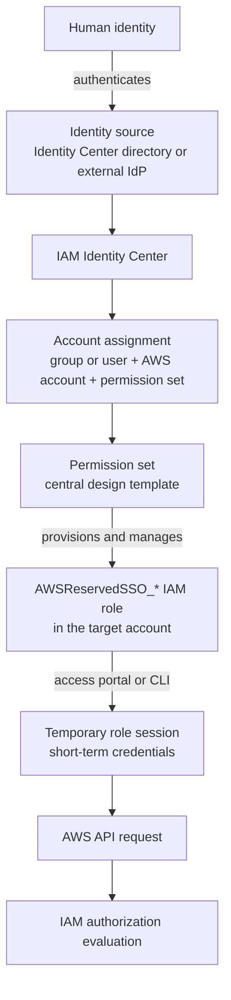
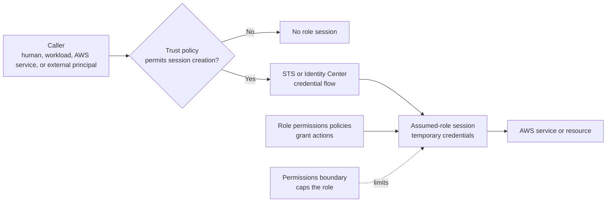
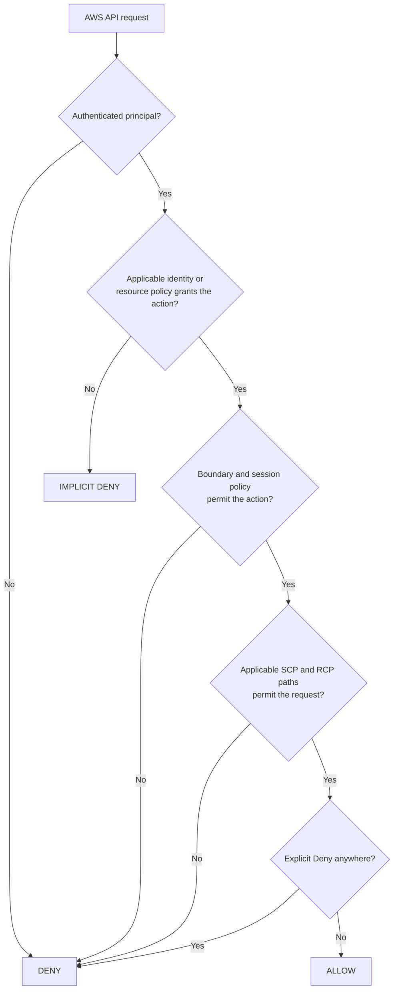
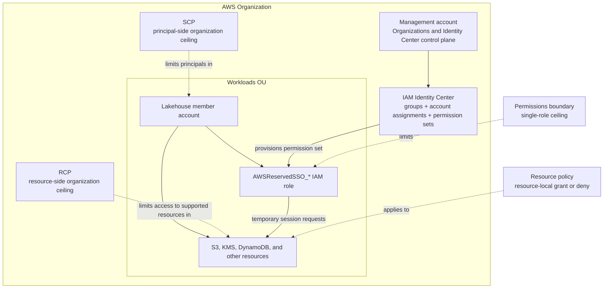

# SAP-C02 Study Guide: AWS Organizations, IAM Identity Center & IAM

*Prepared for: AWS Infrastructure Solution Architect (Beginner) with 20+ years of IT experience in Financial Services and Energy*

---

## Legend — Acronyms and Terms Used in This Document

### Exam and AWS umbrella terms
| Acronym or term | Meaning | Quick context |
|---|---|---|
| **AWS** | Amazon Web Services | The cloud provider. |
| **CoE** | Centre of Excellence | An internal team owning cloud standards. |
| **GA** | Generally Available | A service has moved past preview to full production. |
| **re:Invent** | AWS's annual conference | Major launches and feature announcements. |
| **SAA / SAA-C03 / SAA-C04** | Solutions Architect Associate | The Associate-level architect exam. |
| **SAP-C02** | Solutions Architect Professional, exam code C02 | The current Pro-level architect exam. |

### Identity, access, and authentication
| Acronym or term | Meaning | Quick context |
|---|---|---|
| **ABAC** | Attribute-Based Access Control | Permissions decided by user/resource tags. |
| **AD** | Active Directory | Microsoft's directory service (LDAP/Kerberos). |
| **ARN** | Amazon Resource Name | Unique identifier for any AWS resource. |
| **DLP** | Data Loss Prevention | Controls preventing data exfiltration. |
| **Entra ID** | Microsoft Entra ID | Cloud identity service, formerly Azure AD. |
| **IAM** | Identity and Access Management | The per-account AWS identity service. |
| **IdC** | (IAM) Identity Center | The multi-account workforce identity service (formerly AWS SSO). |
| **IdP** | Identity Provider | The system that authenticates users (Okta, Entra ID, AD, etc.). |
| **JML** | Joiners, Movers, Leavers | The HR lifecycle that drives identity provisioning. |
| **MFA** | Multi-Factor Authentication | Second factor beyond password. |
| **OIDC** | OpenID Connect | Modern federation standard built on OAuth 2.0. |
| **PII** | Personally Identifiable Information | Regulated personal data. |
| **RBAC** | Role-Based Access Control | Permissions tied to a job role. |
| **SAML 2.0** | Security Assertion Markup Language v2 | XML-based federation standard. |
| **SCIM** | System for Cross-domain Identity Management | Standard for automatic user/group provisioning between an IdP and AWS. |
| **SSO** | Single Sign-On | One login giving access to many systems. |
| **STS** | Security Token Service | AWS service issuing temporary credentials. |

### Organizations, governance, and policy
| Acronym or term | Meaning | Quick context |
|---|---|---|
| **CfCT** | Customizations for Control Tower | Framework for extending Control Tower with custom IaC. |
| **CFN** | (AWS) CloudFormation | AWS's native IaC service. |
| **IaC** | Infrastructure as Code | Managing infra via declarative templates (CFN, Terraform). |
| **OU** | Organizational Unit | A logical grouping of AWS accounts inside an Organization. |
| **RAM** | Resource Access Manager | AWS service for sharing resources across accounts. |
| **RCP** | Resource Control Policy | Org-wide guardrail capping who can access your resources (Nov 2024). |
| **SCP** | Service Control Policy | Org-wide guardrail capping what principals can do. |
| **SRA** | (AWS) Security Reference Architecture | AWS's published multi-account security blueprint. |

### Compute, storage, and other services referenced
| Acronym or term | Meaning | Quick context |
|---|---|---|
| **EC2** | Elastic Compute Cloud | AWS virtual machines. |
| **ECS** | Elastic Container Service | AWS-native container orchestration. |
| **EKS** | Elastic Kubernetes Service | AWS-managed Kubernetes. |
| **IRSA** | IAM Roles for Service Accounts | EKS pattern mapping K8s ServiceAccounts to IAM roles via OIDC. |
| **KMS** | Key Management Service | AWS managed encryption key service. |
| **Pod Identity** | EKS Pod Identity | Newer (2023) simpler mechanism replacing IRSA for IAM-to-pod mapping. |
| **S3** | Simple Storage Service | AWS object storage. |
| **SNS** | Simple Notification Service | Pub/sub messaging. |
| **SQS** | Simple Queue Service | Message queueing. |
| **VPC** | Virtual Private Cloud | Logically isolated network in AWS. |

### Policy, code, and operational terms
| Acronym or term | Meaning | Quick context |
|---|---|---|
| **ACL** | Access Control List | Legacy permission mechanism (e.g., S3 object ACLs). |
| **API** | Application Programming Interface | Programmatic interface to a service. |
| **CI/CD** | Continuous Integration / Continuous Deployment | Automated software delivery pipelines. |
| **CLI** | Command Line Interface | Terminal-based AWS interaction. |
| **CloudTrail** | (Service name, not an acronym) | AWS audit log of all API calls. |
| **JSON** | JavaScript Object Notation | The format AWS policies are written in. |

---

## 1. Why These Three Services Matter for SAP-C02

The SAP-C02 exam has four domains:

| Domain | Weight | Identity Relevance |
|---|---|---|
| 1. Design Solutions for Organizational Complexity | **26%** | **Heavy** — multi-account, SCPs, federation, cross-account |
| 2. Design for New Solutions | 29% | Medium — security controls, least privilege |
| 3. Continuous Improvement for Existing Solutions | 25% | Medium — strengthening identity posture |
| 4. Accelerate Workload Migration & Modernization | 20% | Light — federation during migration |

**Practical implication for you:** Roughly **35–40% of the exam touches identity, account structure, or governance** in some form. For a candidate coming from financial services and energy (where regulatory boundaries, separation of duties, and least-privilege are everyday concerns), this is a strong advantage — the patterns AWS tests are familiar enterprise-control patterns expressed in AWS primitives.

---

## 2. AWS Organizations — The Account Container

### What it is
A management service to centrally govern multiple AWS accounts as a single **organization**, structured as a tree: **Management Account → Root → Organizational Units (OUs) → Accounts**.

### Core building blocks you must know cold

- **Management account** (formerly "master") — pays the bills, creates the org, is **exempt from SCPs**. Treat as a vault: minimal workloads, hardware MFA, break-glass only.
- **Member accounts** — everything else; SCPs apply to them.
- **Organizational Units (OUs)** — logical groupings for applying policies. The AWS-recommended baseline OU structure (from the *Organizing Your AWS Environment Using Multiple Accounts* whitepaper) includes: **Security**, **Infrastructure**, **Sandbox**, **Workloads** (Prod / Non-Prod), **Suspended**, **PolicyStaging**, **Deployments**, **Exceptions**.
- **Consolidated billing** — single invoice, **volume discounts and Reserved Instance / Savings Plan sharing pool** across accounts (a frequent exam lever for cost-optimisation questions).
- **Service-linked features** — enable trusted access for services like CloudTrail (org trail), Config (aggregator), GuardDuty, Security Hub, Backup, RAM.

### Policy types (all "guardrails", none grant permissions)

| Policy type | Targets | Purpose | Notes |
|---|---|---|---|
| **SCP** (Service Control Policy) | Principals in member accounts | Cap what your users/roles **can do** | Foundational; tested heavily |
| **RCP** (Resource Control Policy) | Supported resources in member accounts | Cap who **can access your resources** | **New: Nov 2024**; service coverage is expanding, so verify the current supported-services list |
| **Tag policy** | Tags on resources | Standardise tag keys/values | Cost allocation, ABAC |
| **Backup policy** | AWS Backup plans | Centralise backup configuration | DR scenarios |
| **AI services opt-out policy** | AI services | Block data being used for service improvement | Compliance scenarios |
| **Declarative policies** (2024) | Resource configuration | Enforce desired state (e.g., "no public AMIs") | Newer; expect to see |

### SCPs — the deep-dive

- **SCPs do NOT grant permissions.** They define the **maximum** an IAM principal could have. The effective permission = intersection of (SCP) ∩ (identity-based policy) ∩ (resource-based policy) ∩ (RCP) ∩ (permission boundary).
- **SCPs do not apply to the management account.**
- **September 2025 update (important):** SCPs now support the **full IAM policy language** — `Conditions` in Allow statements, `NotResource`, individual resource ARNs in Deny statements, `NotAction` in Allow. This means scenarios that used to require workarounds are now expressible directly.
- **Default `FullAWSAccess` SCP** is attached on enablement. Removing it without an allow-list breaks everything.
- **Strategies:**
  - **Deny-list** (most common): start from FullAWSAccess, deny specific actions/regions/services.
  - **Allow-list**: remove FullAWSAccess, allow only what is needed. Tighter but high-maintenance.
- **Max 5 SCPs per target**; up to 2,000 SCPs in an org.

### RCPs — the newer guardrail (tested as "emerging")

- **Resource-centric** — limit who can access your S3 buckets, KMS keys, STS, Secrets Manager, SQS.
- Plug the gap SCPs cannot fill: **blocking external principals** (e.g., a developer creates a public bucket; the RCP at the OU level denies access from outside your `aws:PrincipalOrgID`).
- Core use case: **data perimeter** — "my data can only be accessed by my identities, from my networks, to my resources."
- Up to 5 RCPs per target; up to 1,000 RCPs in an org; 5,120 character limit per policy.

### Mental model — SCP vs RCP
> **SCP** = "the security guard watching what *my people* do."
> **RCP** = "the security guard watching who touches *my stuff*."

### AWS Control Tower
- A **landing zone orchestrator** built on Organizations + Config + CloudTrail + IAM Identity Center + SSO.
- Provides pre-built **guardrails** (mandatory, strongly recommended, elective) and an **Account Factory** for vending accounts.
- **Exam pattern:** "fastest way to stand up a compliant multi-account environment" → Control Tower. "Highly customised landing zone" → Customizations for Control Tower (CfCT) or the Landing Zone Accelerator solution.

---

## 3. IAM Identity Center (formerly AWS SSO)

### What it is
The **AWS-recommended workforce identity service** for managing human access across multiple AWS accounts and SAML/OIDC-enabled business applications. It replaces the old pattern of IAM users + cross-account roles for human access.

### Why it dominates new exam questions
AWS's modern guidance is unambiguous: **use IAM Identity Center for humans; use IAM roles for workloads.** Long-lived IAM user access keys for humans are now an anti-pattern. Expect SAP-C02 questions to reflect this — answers that propose creating IAM users for federated employees are almost always wrong.

### Key concepts

- **Organization instance** vs **Account instance**:
  - **Organization instance** — for multi-account workforce access. Use this for the exam-typical scenario.
  - **Account instance** (added Nov 2023) — single account, for AWS managed apps like QuickSight.
- **Identity source** — three options:
  1. **Identity Center directory** (built-in)
  2. **Active Directory** (AWS Managed Microsoft AD or AD Connector to on-prem)
  3. **External IdP** (Okta, Azure Entra ID, Ping, Google Workspace) via SAML 2.0 + **SCIM** for automatic provisioning
- **Permission sets** — a template that defines IAM permissions; when assigned, Identity Center provisions a corresponding IAM role in the target account. Think "permission set" as the design artifact; the **IAM role** is the runtime artifact.
- **Assignments** — bind a (User or Group) × (Permission set) × (AWS account). Group-based assignment is the maintainable pattern. OUs organise accounts for Organizations policies; they are not the Identity Center assignment target.
- **ABAC (Attribute-Based Access Control)** — passes user attributes (e.g., `Department`, `CostCenter`) as **session tags**. You then write one policy using `aws:PrincipalTag/Department` and match against resource tags — dramatically fewer permission sets at scale.
- **Trusted identity propagation** — newer feature; user identity is propagated to downstream services (e.g., S3 Access Grants, Redshift, QuickSight) so authorisation happens against the actual human user, not a generic role.

### IAM Identity Center vs IAM federation (SAML to IAM)

| Aspect | IAM Identity Center | Direct SAML federation to IAM |
|---|---|---|
| Multi-account scale | **Native** | Manual role-per-account configuration |
| Permission management | Permission sets, central | Roles in every account |
| User portal | Built-in (access portal + CLI v2 SSO) | DIY |
| Direction of travel | **AWS preferred** | Legacy pattern |

### The modern workforce-access chain

Use this as the default mental model for human access. It replaces the older
habit of beginning every design with an IAM user.



The key distinctions are:

> **Identity Center user ≠ IAM user**
>
> **Permission set ≠ IAM role**
>
> **Permission set → managed IAM role in each assigned AWS account**

Identity Center manages workforce authentication, account assignments, and
the central permission-set configuration. IAM remains the authorization
engine. When a permission set is assigned to an account, Identity Center
creates and manages a role whose name begins with `AWSReservedSSO_`. The access
portal or CLI then provides the authorized person with a temporary session for
that role.

| Component | Mental shortcut | What it does |
|---|---|---|
| **IAM Identity Center** | Workforce access front door | Authenticates or federates human users and manages their AWS-account access |
| **Permission set** | Role template | Defines policies, session duration, and an optional permissions boundary for an account assignment |
| **IAM role** | Temporary AWS identity | Becomes the runtime principal that performs actions inside an AWS account |
| **Trust policy** | Who may wear the role? | Controls which principals or services may create a role session |
| **Permissions policy** | What may the role do? | Grants actions on resources |
| **Permissions boundary** | How powerful may this role ever become? | Caps one IAM role or exceptional IAM user; grants nothing |
| **SCP** | What may identities from this account or OU do? | Organization-level, principal-side guardrail; grants nothing |
| **RCP** | What may be done to supported resources in this account or OU? | Organization-level, resource-side guardrail; grants nothing |
| **Resource policy** | Who may access this resource? | Grants or denies access directly on resources such as S3 buckets and KMS keys |

**Default pattern:** workforce users enter through Identity Center and obtain
temporary role sessions. Workloads use workload roles. IAM users are reserved
for narrow cases where federation or roles are not supported; they are not the
normal employee-access design.

---

## 4. IAM — Still the Foundation

### What it is
The per-account identity and access service. Every AWS API call is authorised through IAM evaluation.

### What you must know

**Principals**
- **IAM user** — long-lived identity; use only for narrow legacy or service-specific cases where federation or roles are unsupported. Do not make it the default human-access or break-glass pattern.
- **IAM role** — temporary credentials via STS; **the default for workloads** (EC2 instance profiles, Lambda execution roles, ECS task roles, EKS IRSA / Pod Identity).
- **Federated identity** — receives temporary role credentials through a federation flow. Direct federation can use STS `AssumeRoleWithSAML` or `AssumeRoleWithWebIdentity`; Identity Center exposes assigned-role credentials through its access portal and `GetRoleCredentials` flow.
- **Root user** — the account owner; centralised root access management (June 2025) now lets you remove root credentials from member accounts entirely.

### IAM role anatomy and role assumption

A role has two separate questions. Keep them separate in every exam scenario:

1. **Who can obtain a session?** The role trust policy answers this.
2. **What can that session do?** The role's permissions policies answer this,
   subject to every applicable ceiling and guardrail.



For direct role switching or cross-account access, the caller uses an STS
role-assumption operation and must satisfy the trust policy. For an
Identity Center-created role, Identity Center manages the role and its trust
configuration; the user selects the assigned account and permission set, then
receives temporary role credentials. In both cases, the runtime identity is a
role session rather than an IAM user.

**Policy types — this is exam gold**
1. **Identity-based** — attached to users/groups/roles (managed or inline).
2. **Resource-based** — attached to resources (S3 bucket policy, KMS key policy, Lambda resource policy, SNS, SQS, Secrets Manager). Specify `Principal` explicitly.
3. **Permission boundary** — caps the maximum permissions an identity-based policy can grant to a user/role. Used to **delegate IAM administration safely**.
4. **SCP / RCP** — covered above.
5. **Session policy** — passed at `AssumeRole`; further narrows the session.
6. **ACLs** — legacy (S3 object ACLs); largely superseded.

### Request authorization: grants plus guardrails

Do not memorize policy evaluation as a simple universal sequence. Instead,
ask whether a grant exists and whether every applicable ceiling permits the
request.

For an AWS request to succeed:

1. The human or workload must be authenticated.
2. For a role session, the relevant trust and federation flow must have
   permitted session creation.
3. An applicable identity-based or resource-based policy must grant the
   requested action.
4. A permissions boundary must permit it, if one is attached to the role or
   user.
5. A session policy must permit it, if one was supplied.
6. The applicable SCP path must permit the principal-side action.
7. The applicable RCP path must permit access to the supported target resource.
8. No applicable policy may explicitly deny the request.



A compact first-pass SAP-C02 formula is:

```text
applicable grant
  ∩ role and session ceilings
  ∩ principal-side organization guardrail
  ∩ resource-side organization guardrail
  − every explicit deny
```

This formula is a reasoning aid rather than a substitute for the complete IAM
evaluation rules. Resource-based policies and role-session principals have
advanced exceptions, so use the official evaluation logic when an answer turns
on those details.

**Cross-account access patterns**
- **IAM role assumption** with trust policy (most common).
- **Resource-based policy** granting access to another account's principal (S3, KMS, Lambda, SNS, SQS, Secrets Manager, etc.).
- **AWS Resource Access Manager (RAM)** — share resources (Transit Gateway, subnets, Route 53 Resolver rules, Aurora clusters, License Manager configs) across accounts in an Org.

**STS essentials**
- Temporary credentials (15 min – 12 hr; default 1 hr).
- **External ID** in role trust policy — the *confused-deputy* defense for third-party access (consultants, SaaS).
- **Source identity** — propagates the original human's identity through role chains for CloudTrail attribution.

**IAM Access Analyzer**
- **External access analyzer** — finds resources shared outside your account/org (zone of trust).
- **Unused access analyzer** (2023) — finds unused IAM roles, users, permissions for least-privilege tightening.
- **Custom policy checks / policy validation** — validate policies pre-deployment in CI/CD.

---

## 5. How They Fit Together (the Picture the Exam Tests)



### Boundary versus SCP versus RCP

| Control | Attachment and scope | Question it answers | Grants access? |
|---|---|---|---|
| **Permissions boundary** | One IAM role or exceptional IAM user | What is the maximum this identity may be granted? | No |
| **SCP** | Organization root, OU, or member account; evaluated for principals governed by that hierarchy | What may identities from this account hierarchy do? | No |
| **RCP** | Organization root, OU, or member account; evaluated for supported resources owned under that hierarchy | What may be done to resources in this account hierarchy, including by external principals? | No |

### Worked Lakehouse example

Assume a developer permission set includes an identity policy granting `s3:*`:

- The permission set also specifies a boundary that permits only `s3:Get*`
  and `s3:List*`.
- A Workloads OU SCP denies actions outside approved AWS Regions, with the
  required global-service exceptions.
- An RCP prevents principals outside the organization from accessing supported
  Lakehouse resources.
- The data bucket policy grants the intended role access to the required
  prefixes.

The developer still cannot write to S3. The permission set attempts to grant
the write action, but the boundary does not permit it. The effective role
permission therefore excludes the write before the SCP, RCP, and bucket-policy
conditions are considered for the particular request.

The recognition shortcuts are:

```text
Permissions boundary → one IAM role or exceptional IAM user
SCP                  → principals governed by an account or OU hierarchy
RCP                  → supported resources governed by an account or OU hierarchy
```

### Official reference anchors

- [IAM roles created by IAM Identity Center](https://docs.aws.amazon.com/singlesignon/latest/userguide/identity-center-and-iam-roles.html)
- [Manage AWS accounts with permission sets](https://docs.aws.amazon.com/singlesignon/latest/userguide/permissionsetsconcept.html)
- [IAM policy evaluation logic](https://docs.aws.amazon.com/IAM/latest/UserGuide/reference_policies_evaluation-logic.html)
- [Permissions boundaries for IAM entities](https://docs.aws.amazon.com/IAM/latest/UserGuide/access_policies_boundaries.html)
- [Resource control policies](https://docs.aws.amazon.com/organizations/latest/userguide/orgs_manage_policies_rcps.html)
- [IAM security best practices](https://docs.aws.amazon.com/IAM/latest/UserGuide/best-practices.html)

---

## 6. SAP-C02 Examination Patterns

### How questions are structured
SAP-C02 questions are **long scenarios (often 6–10 lines)** with multiple constraints. You will see:
- Two technically correct answers — choose the **most optimal** given the stated business context (cost, operational overhead, time-to-market, compliance).
- Distractors that propose **out-of-date patterns** (IAM users for federation, manual role-per-account, AWS SSO old-name).
- "MOST cost-effective", "LEAST operational overhead", "MOST secure" framing — these qualifiers are decisive.

### High-frequency patterns to recognise

1. **Multi-account governance** → Organizations + SCPs + Control Tower.
2. **Federating an existing IdP (Okta/Azure AD/AD)** → IAM Identity Center with external IdP + SCIM provisioning.
3. **Restricting regions or services org-wide** → SCP with `aws:RequestedRegion` or `NotAction`.
4. **Preventing data exfiltration to external accounts** → RCP with `aws:PrincipalOrgID` condition.
5. **Cross-account S3 access** → bucket policy + identity-based policy (and KMS key policy if encrypted).
6. **Third-party SaaS access to your account** → IAM role with trust policy + **External ID**.
7. **Workload identity in EC2/Lambda/EKS** → IAM role (instance profile / execution role / IRSA / Pod Identity), **never access keys**.
8. **Centralising CloudTrail / Config / GuardDuty** → Organizations trusted access, delegated administrator in Security account.
9. **Sharing VPC/TGW/Subnets across accounts** → AWS RAM.
10. **Delegating IAM administration safely** → permission boundaries.
11. **Cost optimisation across accounts** → consolidated billing + Savings Plans/RIs sharing.

### Common traps
- "Create IAM users for each employee" — almost always wrong if federation is feasible.
- "Disable CloudTrail" — never; instead, organisation trail in mgmt account with S3 bucket policy in Security account.
- Confusing **SCP** (principals) with **RCP** (resources) — read the scenario to determine direction.
- Forgetting that **SCPs don't apply to the management account** — exam loves this.
- Forgetting that for cross-account S3 + KMS, you need **three** policies aligned: bucket policy, KMS key policy, identity policy.

---

## 7. Realistic Practice Questions

> Format mirrors actual SAP-C02 questions: long scenario, four options, one best answer. Treat each as a 2-minute exercise.

---

### Question 1 — Multi-account guardrails (Domain 1)

A multinational bank operates 140 AWS accounts across 9 OUs under a single AWS Organization. The risk team mandates that **no member account can disable AWS Config, stop CloudTrail logging, or delete CloudTrail trails** — even by an account administrator. A Cloud Centre of Excellence team in the management account must remain able to perform these actions for legitimate maintenance. The solution must scale to additional accounts being onboarded weekly.

**Which approach meets the requirements with the LEAST operational overhead?**

A. Create an IAM permission boundary in every member account that denies the relevant Config and CloudTrail actions, and attach it to every IAM role in those accounts.

B. Author a Service Control Policy that denies the relevant Config and CloudTrail actions, scope it with a condition that excludes a specific role ARN used by the Cloud CoE, and attach the SCP to the organization root.

C. Use AWS Config rules in every account to detect changes to Config and CloudTrail and remediate via Systems Manager Automation documents.

D. Migrate to IAM Identity Center and remove all IAM users from member accounts so no one has permission to make the change.

<details>
<summary><b>Answer & rationale</b></summary>

**Correct: B.**

- **B** is the canonical SCP pattern: a deny statement protecting Config/CloudTrail actions, with a `Condition` excluding the CoE role via `aws:PrincipalArn`. SCPs at the org root apply to every member account (current and future) automatically — zero overhead per new account. SCPs do not affect the management account, so the CoE acting from there is unaffected anyway, but adding the role exclusion handles the case where the CoE assumes a role into a member account.
- **A** is operationally heavy (permission boundary per role per account) and **boundaries don't apply to the root user** or service-linked roles — escape paths remain.
- **C** is **detective**, not **preventive** — the question asks to prevent the action.
- **D** doesn't help: IAM Identity Center governs *who* signs in, not *what they can do once signed in*. Permission sets still need SCP guardrails on top.

**Exam takeaway:** SCPs are the right hammer for "no one in the org can do X."
</details>

---

### Question 2 — Federation design (Domain 1)

An energy trading company has 25,000 employees managed in Microsoft Entra ID (formerly Azure AD). They are migrating from on-premises to AWS and will run workloads in 60 AWS accounts across multiple environments. Employees must access AWS using their existing Entra ID credentials and MFA. Joiners, movers, and leavers must be reflected in AWS access within 1 hour without manual intervention. Permissions must be defined once and applied consistently across all accounts.

**Which solution best meets these requirements?**

A. Create IAM users in each of the 60 accounts. Configure SAML 2.0 federation between Entra ID and each account's IAM. Write a Lambda function to sync user changes hourly.

B. Configure AWS IAM Identity Center as an organization instance. Use Entra ID as an external SAML 2.0 identity provider. Enable SCIM v2 for automatic provisioning. Create permission sets and assign Entra ID groups to the required AWS accounts.

C. Deploy AWS Managed Microsoft AD and establish a one-way trust from Entra ID. Use AD Connector in each account and create IAM roles for SAML federation.

D. Use IAM Identity Center with the built-in Identity Center directory as the identity source. Export users from Entra ID and import them weekly via the AWS CLI.

<details>
<summary><b>Answer & rationale</b></summary>

**Correct: B.**

- **B** is the modern reference architecture: **Identity Center + external IdP (SAML) + SCIM** delivers automatic JML provisioning (typically within minutes), single set of permission sets reused across accounts, and group-based assignments. This is exactly what AWS prescribes.
- **A** is the legacy anti-pattern — IAM users + per-account federation is unmanageable at 60 accounts and bypasses the SCIM automation requirement.
- **C** introduces Entra ID → AD trust complexity that isn't needed; Entra ID supports SAML/SCIM to IAM Identity Center directly.
- **D** loses Entra ID as the source of truth and the weekly sync misses the 1-hour SLA.

**Exam takeaway:** "external IdP + multiple accounts + automatic provisioning" → **IAM Identity Center + SAML + SCIM**.
</details>

---

### Question 3 — Data perimeter (Domain 1 / Domain 3)

A financial services firm stores customer PII in 400 S3 buckets across 30 member accounts in an AWS Organization. A recent audit found a developer had attached a bucket policy that granted `s3:GetObject` to an external AWS account belonging to a former vendor. The security team needs to **guarantee that no S3 bucket in the organization can be accessed by any principal outside the organization**, regardless of bucket policy contents, while still allowing intra-org access. Existing bucket policies must remain in place to avoid disrupting internal workloads.

**Which control meets the requirement?**

A. A Service Control Policy that denies `s3:*` actions where `aws:PrincipalOrgID` does not match the organization ID, attached to the org root.

B. A Resource Control Policy that denies `s3:*` actions where `aws:PrincipalOrgID` does not match the organization ID, attached to the org root.

C. AWS Config managed rule `s3-bucket-policy-not-more-permissive` deployed via Config Organization rules with auto-remediation through Systems Manager.

D. Block Public Access enabled at the account level for all 30 member accounts, enforced via AWS Control Tower.

<details>
<summary><b>Answer & rationale</b></summary>

**Correct: B.**

- **B** is precisely what RCPs were built for. SCPs cannot block **external principals** because SCPs only constrain identities in your own organization. RCPs, attached to your S3 resources at the org/OU level, evaluate the **resource-side** of the request and can deny access from any principal whose `aws:PrincipalOrgID` doesn't match yours — closing the gap left by a misconfigured bucket policy.
- **A** is the common trap. An SCP cannot restrict what an external account does to your resources; SCPs only govern your own principals.
- **C** is detective + reactive, not preventive — there's still a window of exposure.
- **D** prevents *public* access but does nothing about a bucket policy that grants access to a specific external AWS account.

**Exam takeaway:** *"Restrict external principals from accessing my resources"* → **RCP**. *"Restrict my principals from doing X"* → SCP.
</details>

---

### Question 4 — Delegated administration (Domain 1)

A company's platform team operates the AWS landing zone. Application teams want to create their own IAM roles for their applications so they can move faster, but the security team is concerned that a developer could create a role with `*:*` permissions and effectively grant themselves administrator access. The platform team wants application teams to be **self-sufficient in creating roles within a defined maximum permission envelope**, without security review for every change.

**Which solution achieves this?**

A. Grant application teams `iam:CreateRole` and require security to review CloudTrail logs daily for excessive permissions.

B. Create an IAM permission boundary policy defining the maximum allowed permissions. Grant application teams `iam:CreateRole` and `iam:PutRolePolicy` only when the permission boundary is attached, enforced via a condition `iam:PermissionsBoundary`.

C. Disable `iam:CreateRole` for application teams. Require them to submit a CloudFormation template to the platform team for review before any role is created.

D. Apply an SCP that denies all IAM actions in application accounts, and have the platform team create roles on application teams' behalf via a ticketing system.

<details>
<summary><b>Answer & rationale</b></summary>

**Correct: B.**

- **B** is the textbook **delegated IAM administration** pattern using permission boundaries. The condition `"iam:PermissionsBoundary": "arn:aws:iam::*:policy/MaxPermissions"` on the developer's policy ensures any role they create *must* have the boundary attached, capping its effective permissions regardless of what's in its identity policy. Self-service is preserved; the security envelope is enforced.
- **A** is detective and labour-intensive.
- **C** and **D** kill the team's velocity — directly contrary to the stated goal of self-sufficiency.

**Exam takeaway:** Permission boundaries = **delegate IAM admin without losing the safety net.**
</details>

---

### Question 5 — Workload identity (Domain 2)

A company's data pipeline runs on Amazon EKS. Each microservice pod needs different permissions: some read from specific S3 prefixes, others write to specific DynamoDB tables, others publish to specific SNS topics. The security team wants per-pod least-privilege permissions, no shared credentials, and full CloudTrail auditability of which workload took which action.

**Which approach is best?**

A. Store IAM access keys in Kubernetes Secrets, one set per microservice. Rotate them quarterly using a Lambda function.

B. Give the EKS worker node IAM instance profile broad permissions covering all microservices' needs. Use Kubernetes RBAC to control which pods can do what.

C. Use IAM Roles for Service Accounts (IRSA) or EKS Pod Identity, mapping each Kubernetes service account to a dedicated IAM role with only the permissions that microservice needs.

D. Create a single IAM role with all required permissions and assume it from every pod using STS `AssumeRole` calls from the application code.

<details>
<summary><b>Answer & rationale</b></summary>

**Correct: C.**

- **C** delivers **per-pod IAM roles with temporary credentials** — the modern AWS-recommended pattern. CloudTrail records the specific role, so you can attribute every API call to the correct microservice. **EKS Pod Identity** (2023) is the newer, simpler option; **IRSA** (the predecessor using OIDC) is still fully valid and what older clusters use. Either is the right answer family.
- **A** is the anti-pattern — long-lived access keys in cluster secrets.
- **B** violates least privilege at the IAM layer (Kubernetes RBAC doesn't bound AWS API permissions of the node).
- **D** breaks attribution — every pod looks the same in CloudTrail.

**Exam takeaway:** Workloads → **IAM roles, not keys**. For EKS, the modern answer is **Pod Identity** (or IRSA for older clusters).
</details>

---

## 8. Study Strategy for These Topics

Given your financial services and energy background, lean on these analogies:

- **OUs ≈ trading desks / business units** with their own controls.
- **SCPs ≈ enterprise compliance policy** that applies regardless of local authority.
- **RCPs ≈ data classification / DLP boundary** around assets.
- **Permission boundaries ≈ trading limits** that cap what a delegated person can authorise.
- **IAM Identity Center ≈ corporate SSO portal** with role-based access certifications.

### Recommended primary sources (current AWS documentation)
1. **AWS Whitepaper:** *Organizing Your AWS Environment Using Multiple Accounts* — the OU structure bible.
2. **AWS Whitepaper:** *AWS Security Reference Architecture (SRA)* — the canonical multi-account security design.
3. **AWS Prescriptive Guidance:** *AWS SRA code library* — Terraform/CFN reference.
4. **Official Exam Guide:** *AWS Certified Solutions Architect – Professional (SAP-C02) Exam Guide* (PDF on `d1.awsstatic.com`).
5. **AWS Blogs (Security category):** SCP best practices, RCPs introduction (Nov 2024), SCP full IAM language update (Sept 2025).
6. **AWS Skill Builder:** *Exam Readiness: AWS Certified Solutions Architect – Professional* (free).

### Hands-on lab ideas
1. Stand up an Organization with 3 OUs and 4 member accounts using Control Tower.
2. Attach an SCP denying all regions except `eu-west-1` and `eu-west-2`. Verify in a member account.
3. Configure IAM Identity Center with the built-in directory and assign a permission set to a group across two accounts.
4. Create an RCP requiring `aws:PrincipalOrgID` for S3, and demonstrate it blocks an external account even when the bucket policy allows it.
5. Build the permission-boundary delegation pattern from Question 4 and prove a developer can't escalate.

---

*Document scope: This guide is an overview, not a full curriculum. The SAP-C02 exam is broader — networking, DR, migration, data, ML, generative AI integration. Treat this as your identity-and-governance foundation, then layer the other domains on top.*
