# News Summaries + Energy Data Lake Dashboard - 4 Week Delivery Plan

<!-- markdownlint-disable MD013 -->

## Short Answer

The ChatGPT 5.5 review is directionally right. The original concept is useful, but the stronger portfolio/SAP-C02 version needs clearer trust boundaries, explicit failure handling, least-privilege IAM, observability, cost controls, and a clean split between MVP, target architecture, and optional stretch features.

This plan fits the serverless energy data lake repo because it extends the existing Lambda/EventBridge/S3/Glue/Athena/dashboard path rather than the Fargate ingestion variant.

## Chief Architect Review

### What Is Strong

- The delivery order is correct: skeleton, pipeline, AI merge, then dashboard polish.
- The scope is realistic for a 4-week portfolio project if the MVP is kept narrow.
- The review correctly warns against architecture churn, frontend rabbit holes, and unrealistic "super agent" scope.
- The suggested failure gates are important: bad input and malformed AI output must not reach the dashboard.

### What Needs Tightening

- Add trust boundaries so public delivery cannot read raw, curated, audit, or failed data directly.
- Separate the private processing path from the public static dashboard path.
- Treat OpenClaw/local model execution as an MVP/manual-reviewed path outside AWS unless it is deployed into a real AWS runtime such as Lambda, ECS Fargate, or Bedrock.
- Add data contracts for each boundary: energy input, news summary, AI insight, and dashboard snapshot.
- Add observability, budget controls, and IAM roles as first-class architecture elements.
- Keep DynamoDB Streams as a V1.1 extension, not a critical MVP dependency.

## MVP Architecture Rules

- Public dashboard reads only approved dashboard JSON from the frontend/public artifact path.
- Raw, curated, audit, and failed datasets stay private.
- AI output is schema-validated before publish.
- Malformed AI output is quarantined and never published.
- Static dashboard hosting reads only app assets and public dashboard JSON.
- No NAT Gateway, RDS, or always-on EC2 for the MVP.
- Local OpenClaw is outside AWS unless replaced by Bedrock or a managed compute runtime.

## High-Level Architecture Diagram

Rendered diagram: `diagrams/news-dashboard-high-level.svg`
Mermaid source: `diagrams/news-dashboard-high-level.mmd`

Use the SVG when your editor or Markdown viewer does not render Mermaid directly.

The rendered SVG is generated from `diagrams/news-dashboard-high-level.mmd`.
Keep the `.mmd` file as the source of truth so the embedded documentation does
not drift from the committed diagram asset.

## Detailed Architecture Diagram

Rendered diagram: `diagrams/news-dashboard-detailed.svg`
Mermaid source: `diagrams/news-dashboard-detailed.mmd`

The rendered SVG is generated from `diagrams/news-dashboard-detailed.mmd`.
The current source shows the implemented manual Step Functions proof path,
disabled schedules, deterministic merge boundary, and deferred model/hosting
extensions.

## Data Contracts

| Contract | Producer | Consumer | Purpose |
| --- | --- | --- | --- |
| `energy_input_v1.json` | Energy ingest / Athena export | Normalizer / AI merge | Stable energy market facts with timestamps, units, source, and region |
| `news_summary_v1.json` | News ingest | AI merge | Normalized article summaries with URL, publisher, timestamp, topic, and extracted entities |
| `ai_insight_v1.json` | OpenClaw, Bedrock, or managed AI task | Validator / publisher | Structured insight with confidence, risk level, source references, and reasoning summary |
| `dashboard_snapshot_v1.json` | Publisher | React dashboard | Public-safe dashboard payload with only approved fields |

## IAM Model

| Role | Narrow permission |
| --- | --- |
| `energy-ingest-role` | Read energy API secret, write `raw/energy/`, write logs |
| `news-ingest-role` | Read RSS sources, write `raw/news/`, write logs |
| `ai-merge-role` | Read curated inputs, write candidate AI output, write logs |
| `publisher-role` | Read validated AI output, write dashboard JSON, write audit snapshot |
| `dashboard-read-role` | Read public dashboard JSON only when CloudFront/S3 is used |

## Failure Handling

| Failure | Action | Dashboard impact |
| --- | --- | --- |
| Source API timeout | Retry with backoff, log execution, keep prior dashboard snapshot | No broken dashboard |
| Input validation failed | Write payload to `failed/`, emit CloudWatch alarm | Not published |
| AI output malformed | Quarantine output, notify via SNS, keep previous snapshot | Not published |
| Publisher failed | Store failure record, alert, retry idempotently | Previous snapshot remains available |
| Budget threshold crossed | AWS Budget alert | Manual review before expansion |

## Cost Controls

- Run on a daily schedule for MVP.
- Avoid NAT Gateway, RDS, and always-on EC2.
- Use the existing static React dashboard path before adding backend serving infrastructure.
- Set CloudWatch log retention.
- Keep Lambda runs short-lived.
- Add AWS Budget alert before any live demo period.
- Prefer local OpenClaw for Week 3 MVP; move to Bedrock or managed compute only after the schema gate works.

## Detailed 4-Week Project Plan

### Week 1 - Skeleton First

Goal: add the thinnest working news/dashboard extension without disturbing the existing lakehouse demo.

Deliverables:

- Add `schemas/` for `energy_input_v1`, `news_summary_v1`, `ai_insight_v1`, and `dashboard_snapshot_v1`.
- Add a minimal news ingest Lambda/script path that can run locally first.
- Add private S3 layout notes for `raw/news/`, `curated/news/`, `failed/`, and `audit/`.
- Add one sample dashboard JSON snapshot to the React public data path.
- Add the high-level and detailed architecture diagrams.
- Document MVP vs target scope in README or linked docs.

Acceptance criteria:

- Existing energy dashboard generation still works.
- One news ingest dry run produces a schema-compatible local or S3 object.
- No raw/private bucket data is used directly by the public dashboard.
- Architecture diagrams are committed.

Do not spend time on:

- UI polish.
- Multiple news providers.
- AI quality.
- Complex orchestration.

### Week 2 - Data Pipeline

Goal: ingest energy and news data into stable private raw and curated zones.

Deliverables:

- Energy export maps existing Athena/dashboard data into `energy_input_v1.json`.
- News ingest writes `news_summary_v1.json`-compatible records.
- Validation and normalization step writes good records to `curated/`.
- Failed validation writes to `failed/` and emits a CloudWatch alarm or local evidence file.
- Basic publisher writes a placeholder `dashboard_snapshot_v1.json` from curated inputs.

Acceptance criteria:

- A full local/demo run produces energy input, news summaries, curated output, and dashboard snapshot JSON.
- Bad sample input is rejected and stored under the failure path.
- Logs or evidence files show the full execution path.
- The public dashboard still reads only approved dashboard JSON.

Do not spend time on:

- Perfect news classification.
- Real-time updates.
- DynamoDB Streams.
- Advanced charts.

### Week 3 - AI Merge

Goal: merge energy and news data into validated, traceable insights.

Deliverables:

- Local OpenClaw/manual-reviewed MVP path reads curated inputs.
- AI prompt or merge workflow outputs `ai_insight_v1.json`.
- JSON schema validation rejects malformed AI output.
- Insights include confidence, source references, timestamp, and risk level.
- Publisher converts validated insights into `dashboard_snapshot_v1.json`.
- Invalid AI output goes to `failed/` and triggers notification or evidence output.

Acceptance criteria:

- Valid AI insight publishes to the dashboard JSON path.
- Invalid AI insight does not publish.
- Every dashboard insight has source references.
- A previous good dashboard snapshot remains available if the current AI run fails.

Optional cloud AI path:

- EventBridge or a manual run invokes Bedrock `InvokeModel` and validates the response.
- Or a managed compute task runs OpenClaw.
- Do this only if the local path and schema gate are already working.

Do not spend time on:

- Multi-agent orchestration.
- Automated trading-like decisions.
- Fine-tuning.
- Unreviewed AI output reaching users.

### Week 4 - Dashboard And Portfolio Polish

Goal: make the system clear, demoable, and hiring-ready.

Deliverables:

- Dashboard section with charts, table, and insight panel.
- Public dashboard snapshot loaded from approved JSON only.
- Architecture diagrams: high-level and detailed.
- README with business use case, deployment steps, security notes, cost notes, and known limitations.
- Screenshots and demo script.
- Final validation run and failure-path demonstration.

Acceptance criteria:

- Demo can show ingestion, validation, AI merge, publish, and dashboard consumption.
- Security story is explicit: public dashboard cannot read private lake data.
- Cost story is explicit: scheduled, serverless/static-first, no always-on database or VM.
- Failure story is explicit: bad input and bad AI output are quarantined.

Do not spend time on:

- Redesigning the stack.
- Building a production-grade multi-user app.
- Adding accounts, auth, or admin panels unless required for the demo.

## Stretch Features After MVP

- DynamoDB Streams for high-risk insight alerts and audit fan-out.
- Bedrock cloud AI path once local OpenClaw output schema is stable.
- Athena query layer for historical AI insight analysis.
- API service for richer dashboard queries.
- CI/CD deployment pipeline with preview environments.

## Hiring-Ready Evidence Checklist

- Live dashboard URL.
- GitHub repository with clear commits.
- High-level and detailed architecture diagrams.
- README with MVP, target, security, cost, and failure-handling sections.
- Screenshots.
- Demo script.
- One paragraph explaining the business value: "This system correlates energy market movement with relevant news and publishes traceable, confidence-scored insights."
