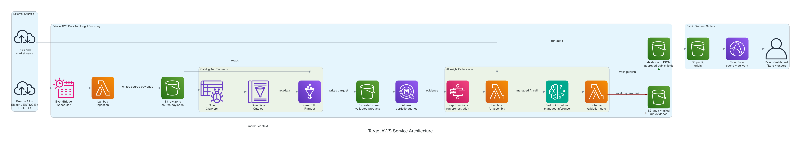

# Target Operating Model

<!-- markdownlint-disable MD013 -->

Purpose: describe the envisioned end-state operating model for the energy
market analytics platform after the current and planned phases are complete.
This is the interview-level view of how the platform is run, governed,
consumed, and safely evolved.

Rendered diagram: `diagrams/target-operating-model.svg`
Mermaid source: `diagrams/target-operating-model.mmd`



## Companion AWS Service Views

The target operating model stays intentionally high level. Use these companion
diagrams when the conversation needs Cloud Architect depth:

- AWS service architecture:
  `diagrams/target-aws-service-architecture.svg`
- AWS service architecture with AWS symbols:
  `diagrams/target_aws_service_architecture_icons.png`
- AWS operations control plane:
  `diagrams/target-aws-operations-control-plane.svg`

The service architecture view explains which AWS services move data from
source APIs into S3, Glue, Athena, Step Functions, AI orchestration, validation,
and the public dashboard boundary.





The operations control-plane view explains how the platform is owned and run:
Terraform, IAM, configuration, secrets, schedules, observability, alerts, cost
controls, runbooks, contract checks, and screenshot evidence.



## Operating Model Story

The platform is designed around one core boundary:

```text
private ingestion, processing, validation, audit, and failure handling ->
approved public dashboard JSON -> decision dashboard and snapshot export
```

The target operating model has five layers:

1. **Users And Decisions**
   Operators inspect risk, exceptions, and freshness. Analysts query curated
   evidence. Reviewers can see the architecture, controls, and delivery
   sequencing.

2. **Public Decision Surface**
   A React dashboard is delivered through a static public path and reads only
   approved dashboard JSON. Exported snapshots carry selected filters and
   source references.

3. **Private Processing And Controls**
   EventBridge schedules, Step Functions, Lambda workflow actions, contract
   validation, AI insight generation, audit writes, failed-path quarantine, and
   notification all remain inside the private AWS boundary.

4. **Lakehouse And Data Products**
   Raw payloads, curated electricity/gas/news/AI outputs, Glue catalog/ETL,
   Athena queries, evidence artifacts, schemas, screenshots, and run proofs are
   kept as governed data products.

5. **Operating Posture**
   Terraform ownership, least-privilege IAM, cost controls, runbooks,
   observability, and quality checks make the platform explainable and
   repeatable.

## Current Versus Target

Current proven state:

- lakehouse ingestion and curated data path
- ENTSOG gas proof
- manual Phase 8 Step Functions orchestration
- deterministic AI insight boundary
- schema validation and failed-run quarantine
- public-safe dashboard snapshot
- Phase 10 operator-focused dashboard Overview
- Phase 11 deterministic dashboard filter wiring
- refreshed architecture diagrams

Target follow-up state:

- CloudFront/S3 public dashboard delivery
- CloudWatch alarms and budget controls
- managed AI invocation through Bedrock or OpenClaw runtime
- carefully enabled schedules after manual proof and operating controls are
  accepted

## Interview Use

Use this diagram when asked:

- "What is the target architecture?"
- "How would this operate in production?"
- "Where are the trust boundaries?"
- "How does AI fit without exposing uncontrolled output?"
- "What remains to make this production-ready?"

The key message:

```text
The project is deliberately sequenced. Each phase proves one operating risk:
data path, gas expansion, orchestration, Terraform ownership, dashboard
decision surface, diagram fidelity, filters, hosting, alarms, and managed AI.
```

If challenged for more detail, move from this TOM to the AWS service
architecture diagram, then to the operations control-plane diagram. That gives
you a clean escalation path from operating model to service selection to
production governance.
